# 页面预览

桌面页面台架截图，含测试草稿，不代表微信真机或真实游客内容。基于最终整合版本生成；完整 48 状态的复现方法见验证记录。

### 路线目录与继续体验

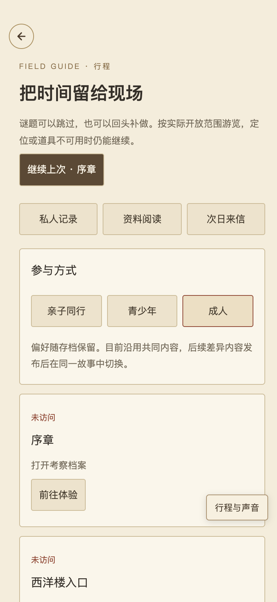

### 资料目录与收藏

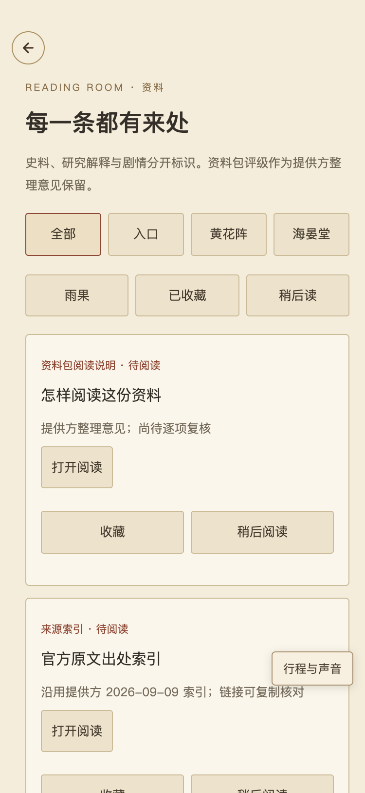

### 来源可追溯的阅读页

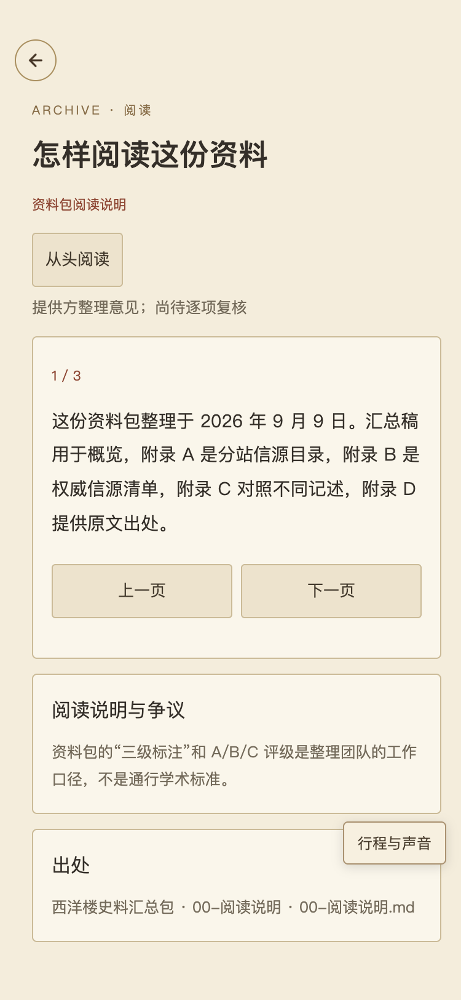

### 无照片也可开始的私人记录

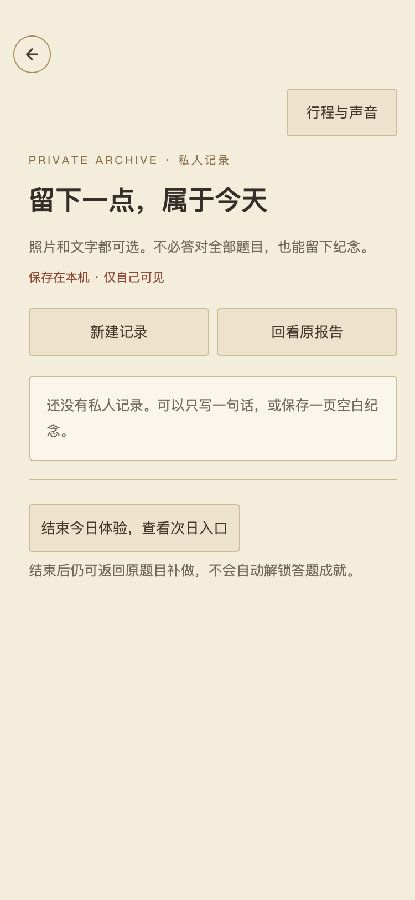

### 私人草稿与保存操作

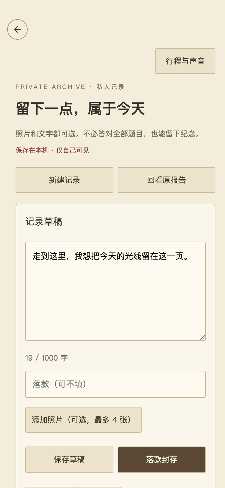

### 未发布次日内容的空状态

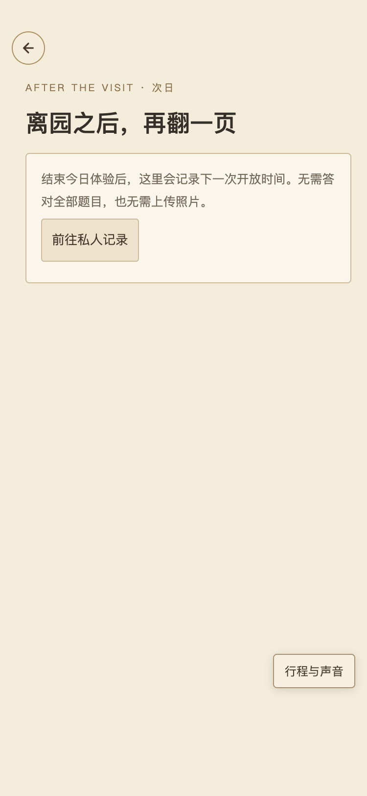

### 开发音乐试听

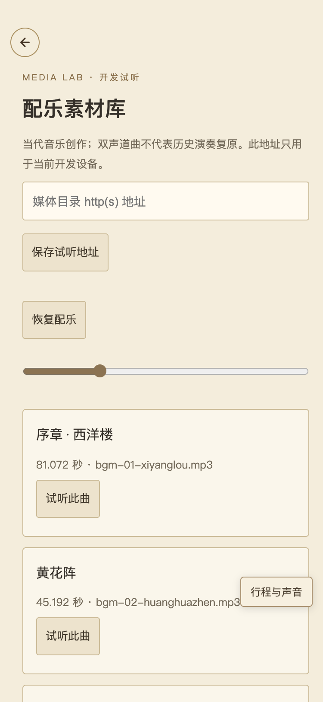

### 全局声音与现场操作

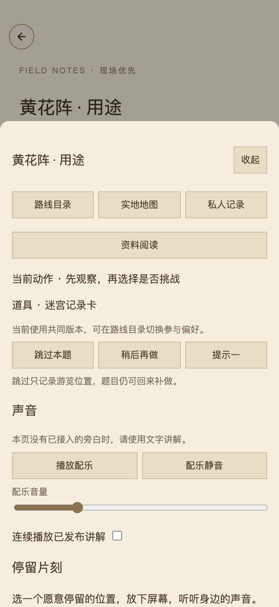

### 保留原有深读内容

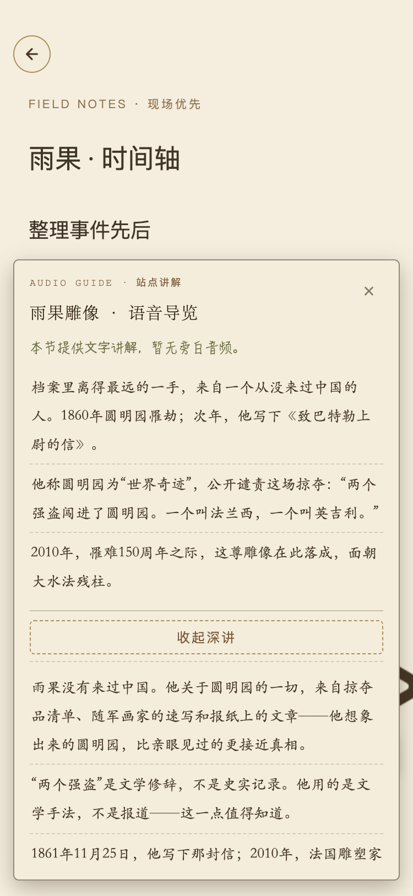

### 大水法静默与自由结束

### 保留顺路支线

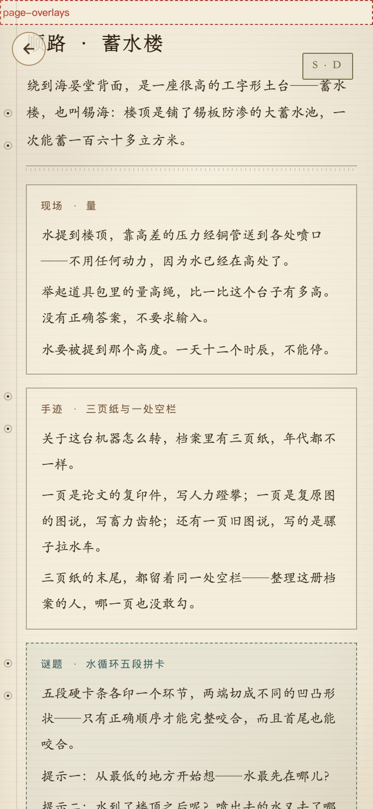

### 明信片转为私人保存

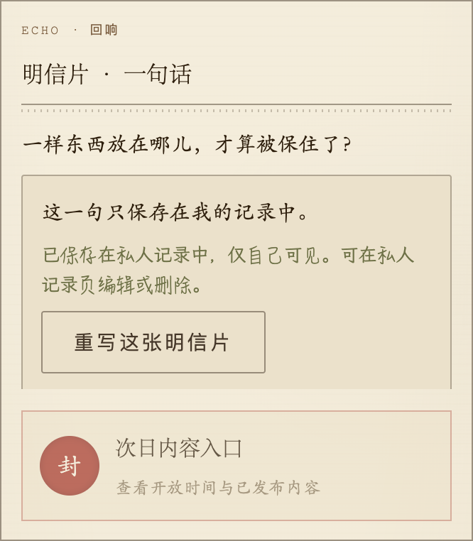

### 题目默认收起

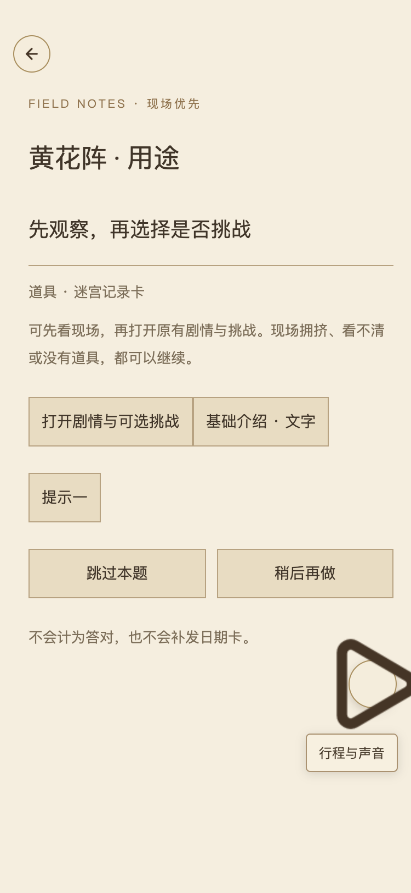

### 日期密码仍可回看与补做

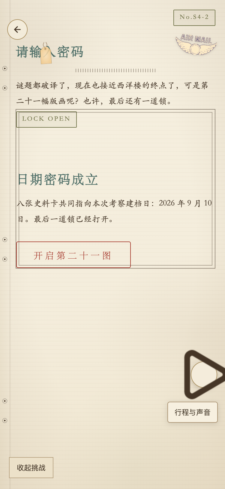
