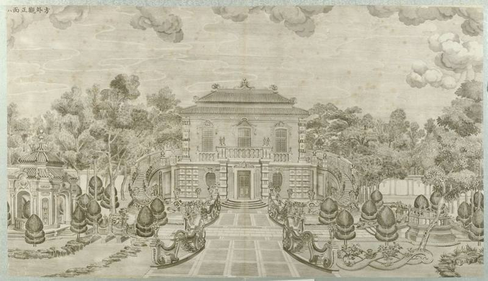
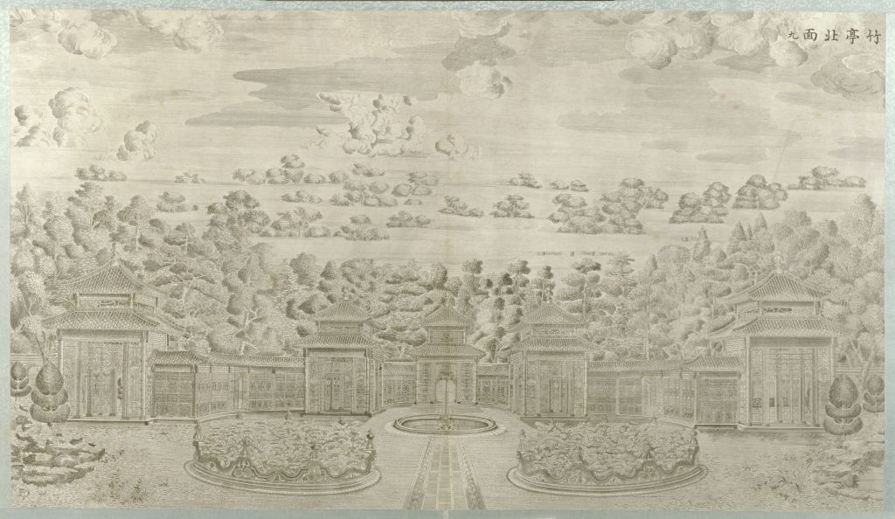
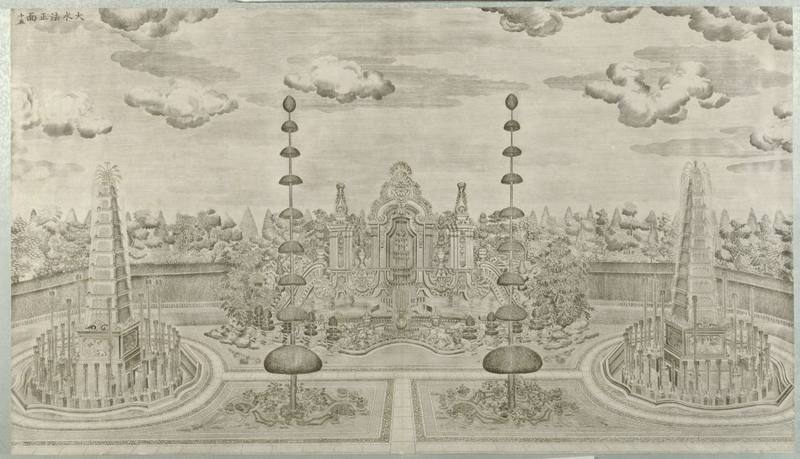

# 图片清册

游客在小程序里看到的图，分三层。历史图像只有第一节那四张铜版。第二节全是项目生成的叙事插图。第三节是界面装饰。

图都在 `plate21/module/assets/img/`。铜版四张合计约 224KB。叙事插图上屏 17 张，合计约 570KB。另有一张宿主首页缩略图，不在游客路线里。

## 一、铜版画（屏幕上只有这四张）

来源同一套：故宫博物院《圆明园铜版画》册，藏品号故 00009171，藏品页 <https://www.dpm.org.cn/collection/paint/228650.html>。乾隆四十六年至五十一年（1781–1786）伊兰泰起稿，造办处在北京刻成，共二十幅。原作已过著作权保护期。小程序用的是故宫数字库 1024 像素图压缩到约 800 像素的文件，没有重绘。

画面题签以图上所写为准（2026-09-22 对过四张原文件）。

| 文件 | 图上题签 | 册中顺序 | 用在哪 | 页面现在写的说明 | 要不要改说明 |
|---|---|---|---|---|---|
| `plate-xieqiqu.jpg` | 谐奇趣南面 | 第 1 开 | 谐奇趣站主图 | 「档案里的《谐奇趣南面》——当年这里奏乐、看水。」 | 图名对。后半句是叙事，不是图签 |
| `plate-fangwaiguan.jpg` | 方外观正面 | 第 8 开 | 方外观站主图 | 「对照档案里这张《方外观正面》」 | 图名对 |
| `plate-dashuifa.jpg` | 大水法南面 | 第 15 开 | 大水法站主图 | 页面直接贴图，没有另写错名 | 对外请写「南面」，不要写「正面」 |
| `plate-xushuilou.jpg` | 蓄水楼东面 | 第 3 开 | 蓄水楼站主图 | 「档案里的《蓄水楼东面》——海晏堂北面那座。」 | **后半句是错的。** 第 3 开是谐奇趣西北蓄水楼，不是海晏堂北面工字楼 |

谐奇趣南面这张扫描左上有一方红印，是故宫数字图档上带的，不是小程序后画的。

第 3 开和第 11 开不是同一座楼：

- 第 3 开《蓄水楼东面》：谐奇趣西北，给谐奇趣喷泉供水。就是现在贴在蓄水楼站上的这张。
- 第 11 开《海晏堂北面》：海晏堂工字楼，俗称锡海。2016 年四角包砖加固的是这一座。小程序里没有这张图。

正文还点了名、但屏幕上没有的两张，也在同一套二十幅里：第 10 开《海晏堂西面》（海晏堂页写了「把档案里的《海晏堂西面》和现场对照」），第 9 开《竹亭北面》（方外观题后提到）。本地二十幅全套在 `docs/plates-20/`，没有打进小程序。

## 二、叙事插图（项目生成，不是史料）

2026-08-11 项目方确认：这些图由项目使用可商用的平台生成，授权用于本项目。生产包用的是压缩后的衍生文件，原始大图不进安装包。

请不要把它们当成遗址照片、旧照或铜版。屏幕上目前没有逐张打「插图」字样。若送审要求标明，需要另加。

| 文件 | 游客在哪看到 | 它扮演什么 |
|---|---|---|
| `IMG-RUNTIME-COVER.jpg` | 封面主图 | 线稿风封面，不是现场照片 |
| `IMG-RUNTIME-PROLOGUE-STUDY.jpg` | 次日回访长卷里的「入口」 | 档案桌插图 |
| `IMG-RUNTIME-PROLOGUE-CARD.jpg` | 序章 | 一张虚构的民国著录卡。上面的「闻有第二十一图，未见」是产品设定，不是馆藏著录 |
| `IMG-RUNTIME-MAP.jpg` | 序章、站间过渡 | 简化路线图，不是测绘图，也不是管理处官方地图 |
| `IMG-RUNTIME-MAZE.jpg` | 黄花阵修建目的题、回访长卷 | 迷宫意象。黄花阵的历史图像应是铜版第 4、5 开，这两开没上屏 |
| `IMG-RUNTIME-LANTERN.jpg` | 黄花阵名字由来 | 宫女持黄绸莲花灯的叙事图，不是文物照片 |
| `IMG-RUNTIME-DETAIL-DOME.jpg` | 黄花阵中心亭对读 | 穹顶与飞檐的示意 |
| `IMG-RUNTIME-DETAIL-BEAST.jpg` | 同上；回访长卷把这张用作海晏堂 | 檐角立兽示意。回访页用它代表海晏堂，容易看成兽首，建议换图或改说明 |
| `IMG-RUNTIME-DETAIL-LOTUS.jpg` | 黄花阵中心亭对读 | 莲座与宝瓶示意 |
| `IMG-RUNTIME-DETAIL-SWAN.jpg` | 同上 | 双天鹅与蝙蝠纹示意 |
| `IMG-RUNTIME-PATTERN-WANZI.jpg` | 黄花阵墙纹题 | 万字回纹示意。母题与官网「镶卍字雕花青砖」相符，图本身是生成的 |
| `IMG-RUNTIME-PATTERN-SHELL.jpg` | 同上，干扰项 | 贝壳饰，不是这道墙上的纹 |
| `IMG-RUNTIME-PATTERN-SCROLL.jpg` | 同上，干扰项 | 卷草饰 |
| `IMG-RUNTIME-PATTERN-BASKET.jpg` | 同上，干扰项 | 花篮饰 |
| `IMG-RUNTIME-COMIC.jpg` | 海晏堂正午一问 | 十二时辰四格漫画，不是水力钟原图 |
| `IMG-RUNTIME-HUGO.jpg` | 雨果站、回访长卷 | 雨果像的叙事图，不是 2010 年雕像照片 |
| `IMG-RUNTIME-PLATE.jpg` | 终章、考察报告、手册缩略、回访长卷 | 「第二十一图」底图。产品虚构，不是第二十一幅铜版 |

同目录里还有一批 `IMG-*.jpg` 源图（封面、路线、纹样等的大图）。安装包排除了它们，页面也不直接显示，除了未接入路由的结束页草稿还指着 `IMG-R01.jpg`。送审不必把这批源图当在用素材。

## 三、界面装饰（不讲遗址）

小图标 `icons/ic-*.png` 共 19 个，由 Lucide 图标改色导出，ISC 许可，内容是返回、播放、地图钉、下载这一类。

贴纸来自 CC0 或公有领域（回形针、票根、植物、英国红便士邮票、美国 1861 年 2 分邮票、旧纸纹理），见 `plate21/module/assets/NOTICE.md`。

需要园方看一眼的只有自制邮戳 `stickers/st-postmark-01.png`：外圈写 “YUANMINGYUAN · PEKING”，中间日期是 **18 OCT 1860**。这是界面装饰，不是历史实物。日期用了火烧圆明园当天，是否保留请管理处定。

按钮底纹 `ui/btn-label-*.png` 是项目自制的墨色和印章形状，无遗址内容。

手写字体是霞鹜文楷的开源子集，不是图片，不在本清册。

## 四、道具上要用的图

正文要做一套实物。多数还没印。样子写在这里，能对上的图跟在后面。屏幕上已经贴出来的，第一节、第二节里有，这里不重复贴。

| 编号 | 样子 | 图 | 状态 |
|---|---|---|---|
| DJ-02 档案袋 | 牛皮纸手提袋。白标签：「西洋楼现场考察资料／未完成」 | 无图 | 未做 |
| DJ-03 日记 | 只印正面三行：寻廿一图；十二兽各守一时，至午而全见；海晏以水记时，大水法以水成戏。背面空白 | 无图 | 未做 |
| DJ-04 遗址地图 | 正面西到东，圈黄花阵、海晏堂、北面蓄水楼、远瀛观。反面标西洋楼在长春园东北 | 现在屏幕用的是绘制路线图，不是这张手绘地图 | 未做，屏幕有顶替图 |
| DJ-05a 方外观正面 | 铜版原图，对照卡或镂空书签 | [图](props/DJ-05a-fangwaiguan.jpg) | 屏幕已贴同一张；实物未做 |
| DJ-05b 竹亭北面 | 同上 | [图](props/DJ-05b-zhuting.jpg) | 正文点了名，屏幕没贴，实物未做 |
| DJ-05c 海晏堂西面 | 同上 | [图](props/DJ-05c-haiyantang.jpg) | 正文点了名，屏幕没贴，实物未做 |
| DJ-05d 大水法南面 | 同上 | [图](props/DJ-05d-dashuifa.jpg) | 屏幕已贴同一张；实物未做 |
| DJ-06 音乐贴 | 外形像唱片，可带 NFC。NFC 不能当过关 | 声音在 [02-audio.md](02-audio.md)，文件 [props/DJ-06-soundscape.mp3](props/DJ-06-soundscape.mp3) | 声音已定；贴本身未做 |
| DJ-07 特刊 | 报纸，能看见「蓄水楼」。题是建得高还是低 | 无图 | 未做 |
| DJ-09 黄花阵图 | 迷宫平面，加上手持黄绸莲花灯的宫女 | 屏幕顶替：[迷宫](props/DJ-09-maze.jpg)、[提灯](props/DJ-09-lantern.jpg) | 未做，图是绘制稿 |
| DJ-10 中西手册 | 小册子。亭子四页，墙纹四页，其中一页是万字纹 | 屏幕顶替：`props/DJ-10-dome.jpg`、`beast`、`lotus`、`swan`、`wanzi`、`shell`、`scroll`、`basket` | 未做，图是绘制稿 |
| DJ-14 信和信封 | 《致巴特勒上尉的信》节选。信封不印「黄花阵」 | 无图。屏幕只引用了「两个强盗」一句，节选全文未定 | 未做 |
| DJ-15 文物卡四张 | 背面各一句：石屏风回到园内；翻尾石鱼在北京大学；七根石柱回到中国；铜鹿铜狗不在原位 | 无图 | 未做 |
| DJ-16 明信片 | 背面只印：「一样东西放在哪里，才算真正被保住了？」 | 无图 | 未做 |

不做实物的：小纸片、半字信封、空白记录页、放大镜、八张日期卡、透视框。养雀笼、线法画这版不发道具。

## 五、本地有图、小程序没用

| 是什么 | 在哪 | 为什么先不送成「在用」 |
|---|---|---|
| 故宫二十幅 1024 像素全套 | `docs/plates-20/` | 屏幕只用了上面四张。其余十六张没有上屏 |
| 史料卡配图底稿（铜版书影、遗址旧影、论文插图） | `docs/sl-source-images/` | 史料卡目前只有文字，这些图没有进卡 |
| 设计稿用的另一套界面图 | `docs/v3-ui-assets/` | 画板用，不是小程序运行图 |
