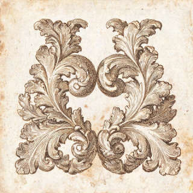

# 正文里各段用什么

骨架是正文的章节，不是小程序文件。每一段下面固定四格：道具、图、声音、史料。

同一件道具只在总表里写一次样子。后面各章只写「这一段拿出来做什么」。

状态只有四种：

| 状态 | 意思 |
|---|---|
| 要做 | 正文要用的实物，还没有做出来 |
| 屏幕在用 | 小程序这一页已经在显示 |
| 屏幕顶替 | 本来是手里的道具，现在用一张屏幕图先顶着 |
| 不做 | 正文提过，这版不做 |

屏幕现在每一页的文件清单在 [pages.md](pages.md)。这里不重复贴路径。

## 道具总表

袋里这一套，18 件。屏幕交互、日期角、终局拼图不算道具。

| 编号 | 名称 | 样子 | 哪一段拿出来 |
|---|---|---|---|
| DJ-02 | 档案袋 | 牛皮纸手提袋。白标签：「西洋楼现场考察资料／未完成」。别的纸都装在里面 | 全程 |
| DJ-03 | 日记 | 只印正面三行。①寻廿一图。旧闻有迹，余尝往寻；所得未尽，留俟后人。②十二兽各守一时，至午而全见。③海晏以水记时，大水法以水成戏。背面空白。序章里那封信就是这本，不另做信封 | 序章读①；海晏堂对②；蓄水楼对③ |
| DJ-04 | 西洋楼遗址地图 | 正面西到东：谐奇趣后圈出黄花阵，写「灯行阵中，路藏墙间。」方外观后画到海晏堂。海晏堂北面标蓄水楼。远瀛观旁圈「上观其形。」反面：西洋楼在长春园东北 | 序章交到手里之后，沿路改这一张 |
| DJ-05a | 对照铜版·方外观正面 | 铜版原图做成对照卡或镂空书签。不当史料卡的配图 | 方外观 |
| DJ-05b | 对照铜版·竹亭北面 | 同上 | 方外观题后 |
| DJ-05c | 对照铜版·海晏堂西面 | 同上 | 海晏堂 |
| DJ-05d | 对照铜版·大水法南面 | 同上 | 大水法，并用来认远瀛观 |
| DJ-06 | 谐奇趣音乐贴 | 外形像一张唱片，可以贴 NFC。NFC 不能当过关条件。贴上播的是下面这段声景 | 谐奇趣 |
| DJ-07 | 特刊 | 一张报纸，能看见「蓄水楼」。题是：为了供水，通常建得比较高，还是比较低 | 蓄水楼。海晏堂结尾先把报纸交给游客 |
| DJ-09 | 黄花阵图 | 一张图：迷宫平面，加上宫女手持黄绸莲花灯 | 黄花阵，问名字 |
| DJ-10 | 中西手册 | 小册子。亭子四页：穹顶与飞檐、檐角立兽、莲座花苞、天鹅藏蝙蝠。墙纹四页，其中一页是万字纹 | 黄花阵中心亭、墙纹 |
| DJ-14 | 公开信和信封 | 信封里是《致巴特勒上尉的信》节选。信封上不要印「黄花阵」。夹层放四张文物卡 | 雨果 |
| DJ-15a | 文物卡·石屏风 | 背面一句：离开原址后，后来重新回到圆明园 | 雨果 |
| DJ-15b | 文物卡·翻尾石鱼 | 背面一句：如今留在北京大学 | 雨果 |
| DJ-15c | 文物卡·七根石柱 | 背面一句：流散海外百余年，后来重新回到中国 | 雨果 |
| DJ-15d | 文物卡·铜鹿铜狗 | 背面一句：原本属于大水法喷水装置，如今已经不在原位 | 雨果 |
| DJ-16 | 明信片 | 背面只印：「一样东西放在哪里，才算真正被保住了？」游客自己留着，不交上来 | 雨果 |

不做的：DJ-01 小纸片（只在屏幕上）、半字信封、空白记录页、放大镜、开场五张残片、八张实体日期卡、透视框。养雀笼、线法画这版正文不发道具。

下面几张是道具正面要用的图。铜版是原图。地图、黄花阵、手册现在只有屏幕上的绘制稿，实物还没按这个开印。

方外观正面。

竹亭北面。

海晏堂西面。

大水法南面。

音乐贴里的声音，定稿，无水、无人声。

[DJ-06 声景](props/DJ-06-soundscape.mp3)

屏幕上暂时顶着的地图、黄花阵图、手册内页：

## 序章

游客收到袋子，读日记第一行，看到二十幅铜版没有第二十一幅。

| 格 | 用什么 |
|---|---|
| 道具 | DJ-02 档案袋，从这里拎走。DJ-03 日记，读第①行。DJ-04 地图放在袋里，这一段先不画圈 |
| 图 | 屏幕有一张绘制的著录卡，不是道具。封面还有一张绘制主图 |
| 声音 | 旁白念这一屏。史料卡老者播报（YX-SL）正文表里有，还没录 |
| 史料 | SL-01《西洋楼铜版图》：二十幅，乾隆四十六年至五十一年，伊兰泰起稿，造办处刻成，没有第二十一幅 |

屏幕多写了贺清泰、潘廷璋。道具和史料卡都不印这句。

## 序章之后、进门

正文这里有一道地理四选：西洋楼在长春园什么位置。答完才弹出两张卡，并让游客看对照铜版。

| 格 | 用什么 |
|---|---|
| 道具 | DJ-04 翻到反面，看西洋楼在长春园东北。DJ-05 整套对照铜版从这里可以翻，真正举起来是后面各站 |
| 图 | 屏幕上的路线图从这一段开始用，顶着 DJ-04。四张对照铜版还没放进这一页 |
| 声音 | 正文写过「用音频介绍西洋楼」（YX-序2）。稿还没写。若做，念 SL-02 和 SL-05 |
| 史料 | 答完才出 SL-02 西洋楼、SL-05 长春园。题前出卡会把答案说漏 |

屏幕现在的入口页只弹出了 SL-02，没有这道地理题，也没有 SL-05。

## 谐奇趣

到站，听三十秒，再选听见了什么。听完才解释水法。地图上圈出下一站黄花阵。

| 格 | 用什么 |
|---|---|
| 道具 | DJ-06 音乐贴。DJ-04 在谐奇趣后面圈黄花阵，写「灯行阵中，路藏墙间。」 |
| 图 | 屏幕贴铜版《谐奇趣南面》。这张不在 DJ-05 四张对照卡里，是页面自己贴的 |
| 声音 | YX-06，就是总表里那段声景。琵琶、小拉琴、西洋箫，没有水。页面现在还在播旧文件，并把水声算进正确答案 |
| 史料 | 听之前 SL-03 谐奇趣。听完 SL-06 水法。卡不写「皇家园林史上首座」。屏幕开场多了这半句 |

## 黄花阵

四件小事。前两件不靠新道具，后两件用袋里的图和手册。四件都做完才说今墙是重修的。

名字从哪来。

| 格 | 用什么 |
|---|---|
| 道具 | DJ-09 黄花阵图：平面加上提灯的宫女 |
| 图 | 屏幕用两张绘制图顶着：迷宫、提灯。见总表 |
| 声音 | 旁白问灯，答完念灯会 |
| 史料 | 进迷宫时 SL-07，只说是迷宫，也称万花阵。灯会不做成卡 |

中心亭，再是墙纹。

| 格 | 用什么 |
|---|---|
| 道具 | DJ-10 中西手册。先翻亭子四页，再翻墙纹四页。墙上对得上的是万字纹 |
| 图 | 屏幕用八张绘制图顶着手册内页。见总表 |
| 声音 | 旁白。墙纹页另有两句编的匠人、师傅台词，不是道具上的字 |
| 史料 | 四件做完，SL-08：现在的墙和亭是 1987、1989 年按原样重修的 |

讲解还点了铜版第四开、第五开（花园门北面、花园正面），说重修照的是这两幅。没有定成道具，屏幕也没贴。

## 方外观

举起正面铜版，选出楼身上的三样。答完才翻到竹亭，才提容妃。

| 格 | 用什么 |
|---|---|
| 道具 | DJ-05a 方外观正面。题后 DJ-05b 竹亭北面 |
| 图 | 屏幕已经贴了《方外观正面》。竹亭北面还没贴 |
| 声音 | 旁白。导览里有一句「她每次来，乾隆都陪着来」，比史料卡说得更死 |
| 史料 | 题前 SL-09，只写位置、年份、环形石阶，不先说两层、中式顶、碑。题后 SL-10 容妃，香妃是传说。SL-11 五竹亭，等候一说标成传说 |

## 海晏堂

对照西面铜版。日记第②行对上正午。结尾把特刊交给游客，指向北面高台。

| 格 | 用什么 |
|---|---|
| 道具 | DJ-05c 海晏堂西面。DJ-03 日记第②行：十二兽各守一时，至午而全见。DJ-07 特刊在这里交出去，下一站才翻开 |
| 图 | 屏幕没有西面铜版，贴的是一张绘制的四格漫画 |
| 声音 | 旁白。这一页的导览把兽首「七尊已归」说死了，道具上不印这句 |
| 史料 | 题前 SL-12 海晏堂，不写正午谁在喷。结尾 SL-13，先点出有一座蓄水楼，两座的区分到下一站再说 |

正午十二首一起喷，是这一页的题，不做成史料卡。手册里另有一句「马首喷、其余十一首齐喷」，和这里不一致，不以手册那句为准。

## 蓄水楼

翻开特刊。问建得高还是低。日记第③行在这里对上。

| 格 | 用什么 |
|---|---|
| 道具 | DJ-07 特刊，题面就是高或低。DJ-03 日记第③行：海晏以水记时，大水法以水成戏 |
| 图 | 屏幕贴的是铜版《蓄水楼东面》，第 3 开，谐奇趣西北那座。图注写成了海晏堂北面。这一张不是 DJ-05，也不该拿来当海晏堂的锡海 |
| 声音 | 旁白。导览讲的是海晏堂背面锡海、一百六十余立方米，和屏幕这张图不是同一座 |
| 史料 | 题前再点 SL-13：两座蓄水楼不是同一座。题后 SL-04：没有电泵，靠高度差。谁把水提上去，不选一种 |

## 大水法，顺看远瀛观

对照南面铜版，把鹿、猎狗、卷尾铜兽放回位置。抬头是远瀛观，转身是观水法。不另开一站。地图在远瀛观旁圈「上观其形。」

| 格 | 用什么 |
|---|---|
| 道具 | DJ-05d 大水法南面。DJ-04 圈远瀛观 |
| 图 | 屏幕已经贴了《大水法南面》 |
| 声音 | 旁白。这一页没有背景音乐 |
| 史料 | 到站 SL-14 大水法。转身 SL-15 观水法。远瀛观不做卡 |

## 雨果

自己读信。四张文物卡看背面。明信片的问题没有标准答案。

| 格 | 用什么 |
|---|---|
| 道具 | DJ-14 信和信封。DJ-15 四张卡，背面各一句，见总表。DJ-16 明信片 |
| 图 | 屏幕是一张绘制的雨果像，不是雕像照片，也不是道具 |
| 声音 | 信自己读，不配朗读。旁白和导览会念到「两个强盗」那一句，并说明是文学说法 |
| 史料 | 读遗物之前 SL-17：1861 年的信，人没来过圆明园 |

兽首现在归了几尊、石屏能不能称第一件、石鱼能不能写未名湖、石柱用哪一年、铜鹿铜狗怎么说，道具背面用的是总表那四句短话，不印屏幕上更具体的年份。

## 终章

没有新道具。屏幕把沿路的图样拼成一幅，中间空着，印「此处待绘」。这张叫第二十一图，是虚构，不是第二十一幅铜版。

日期写在屏幕卡片角上，不做八张实体日期卡。

## 正文没走、小程序里还有

这些不是这一套道具里的东西。小程序手册仍进得去。

| 地方 | 现在有什么 | 正文 |
|---|---|---|
| 养雀笼 | 旁白和导览，没有图，没有道具 | 不发道具 |
| 观水法散页 | 旁白、两句乾隆台词、导览。主线在大水法已经讲过位置 | 不单开 |
| 线法画 | 旁白和导览，没有图 | 不做卡，不发道具 |
| 次日之信 | 只有背景音乐 | 不算道具 |
| 留言簿 | 五张绘制图。代表海晏堂的那张其实是亭子檐角 | 不算道具 |
