# 各页用了什么

游客能走进的每一页，用到的内容图、声音、史料卡。内容图已按页拷进 `by-page/` 同名文件夹，打开文件夹就是这一页的图。

性质只有三种：铜版（故宫《圆明园铜版画》册，故00009171，未重画）、绘制（项目生成，不是照片也不是铜版）、装饰（贴纸、图标，不讲遗址）。

旁白是合成语音，念的是该页上的字。导览是页面上点开才播的另一段。背景音乐没有歌词。

## 总表

| 页 | 内容图 | 旁白 | 导览 | 背景音乐 | 点开的史料卡 |
|---|---|---|---|---|---|
| 01 首页 | 绘制缩略图 1 | 无 | 无 | 无 | 无 |
| 02 门票 | 无 | 无 | 无 | 无 | 无 |
| 03 封面 | 绘制封面 1；装饰邮戳写着 1860-10-18 | 无 | 无 | 无 | 无 |
| 04 序章 | 绘制著录卡 1、绘制路线图 1 | prologue 四屏 + 交接，5 条 | 无 | bgm-01 | SL-01 铜版图 |
| 05 入口 | 无 | 入口 4 条 | 无 | bgm-01 | SL-02 西洋楼 |
| 06 走路 | 绘制路线图 1（七段共用） | 无 | 无 | 无 | 无 |
| 07 谐奇趣 | 铜版《谐奇趣南面》 | 到站、答完，2 条 | 谐奇趣短 + 深 | bgm-07x | SL-03 谐奇趣，SL-06 水法 |
| 08 黄花阵·目的 | 绘制迷宫 1 | 2 条 | 黄花阵短 + 深 | bgm-02 | SL-07 黄花阵 |
| 09 黄花阵·名字 | 绘制提灯 1 | 2 条 | 同上 | bgm-02 | 无 |
| 10 黄花阵·中心亭 | 绘制示意 4 | 1 条 | 同上 | bgm-02 | 无 |
| 11 黄花阵·墙纹 | 绘制纹样 4 | 旁白 2 条；匠人、砌墙师傅各 1 条 | 同上 | bgm-02 | SL-08 今墙 |
| 12 方外观 | 铜版《方外观正面》 | 到站、答完，2 条 | 方外观短 + 深 | bgm-03 | SL-09 方外观，SL-10 容妃，SL-11 五竹亭 |
| 13 海晏堂 | 绘制四格 1。正文点了《海晏堂西面》，页面没贴这张图 | 2 条 | 海晏堂/大水法短 + 深 | bgm-04 | SL-12 海晏堂，SL-13 蓄水楼 |
| 14 蓄水楼 | 铜版《蓄水楼东面》。图注写成了海晏堂北面，与画面不符 | 2 条 | 蓄水楼短 + 深 | bgm-10 | SL-13 蓄水楼，SL-04 喷泉原理 |
| 15 大水法 | 铜版《大水法南面》 | 4 条 | 无 | 无 | SL-14 大水法，SL-15 观水法，SL-17 雨果 |
| 16 雨果 | 绘制雨果像 1 | 2 条 | 雨果短 + 深 | bgm-12 | 无 |
| 17 八位日期 | 无 | 1 条 | 同上 | bgm-12 | 无 |
| 18 终章 | 绘制「第二十一图」1 | 3 条 | 无 | bgm-06 | 无 |
| 19 报告 | 同一张「第二十一图」 | 无 | 无 | 无 | 无 |
| 20 手册 | 同一张「第二十一图」 | 无 | 无 | 无 | 手册自带 3 张旧卡，不是上面的 SL |
| 21 养雀笼 | 无 | 4 条 | 养雀笼短 + 深 | bgm-09 | 无 |
| 22 观水法 | 无 | 旁白 3 条；乾隆台词 2 条 | 观水法短 + 深 | 无 | 无 |
| 23 线法画 | 无 | 4 条 | 线法画短 + 深 | bgm-11 | 无 |
| 24 次日之信 | 无 | 无 | 无 | bgm-13 | 无 |
| 25 留言簿 | 绘制 5。其中檐角示意被当成海晏堂 | 无 | 无 | 无 | 无 |
| 26 旧页·认兽首 | 无。主线不进 | 1 条，另有蒋友仁台词 | 同海晏堂 | bgm-04 | 无 |
| 27 旧页·校正午 | 无。主线不进 | 1 条 | 同海晏堂 | bgm-04 | 无 |

SL-05 长春园已写好，没有任何一页点到它。

## 01 首页

`pages/index/index`

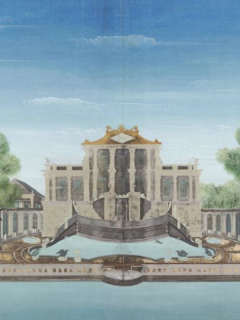

| 位置 | 文件 | 画面 | 性质 |
|---|---|---|---|
| 卡片缩略 | `assets/host/IMG-RUNTIME-HOST.jpg` | 封面的缩小版 | 绘制 |

装饰：邮戳、回形针、手册小图标。无声音，无史料卡。

## 02 门票

`plate21/module/pages/gate/gate`

无图，无声音。字只列路线：入口、谐奇趣、黄花阵、方外观、海晏堂、蓄水楼、大水法、雨果。

## 03 封面

`plate21/module/pages/cover/cover`

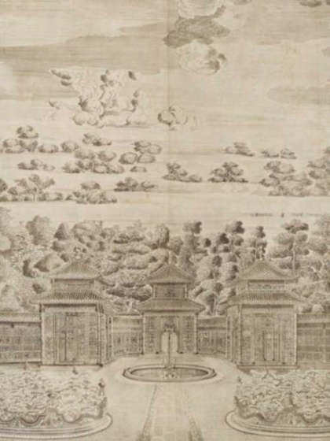

| 位置 | 文件 | 画面 | 性质 |
|---|---|---|---|
| 主图 | `IMG-RUNTIME-COVER.jpg` | 线稿风封面 | 绘制 |
| 邮戳 | `stickers/st-postmark-01.png` | 自画邮戳，日期 1860-10-18 | 装饰，日期要审 |

另有吊牌、麦穗贴纸、手册图标。无声音。图下的字「闻有第二十一图，未见」是虚构。日期章「乾隆四十六年 / 1781」是铜版起稿年。

## 04 序章

`plate21/module/pages/prologue/prologue`

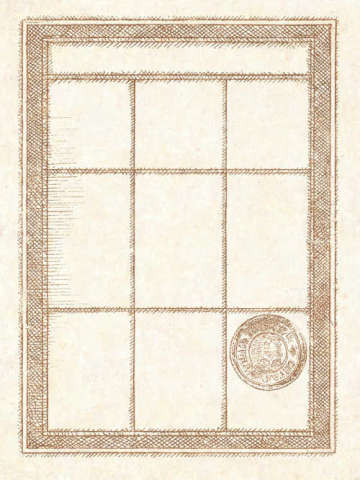

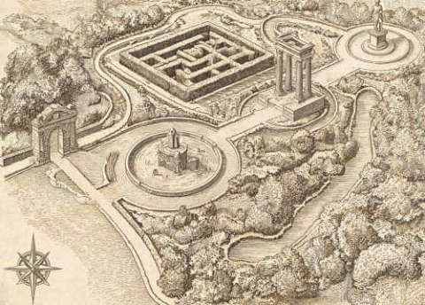

| 位置 | 文件 | 画面 | 性质 |
|---|---|---|---|
| 第三屏 | `IMG-RUNTIME-PROLOGUE-CARD.jpg` | 画出来的著录卡，不是馆藏 | 绘制 |
| 交接 | `IMG-RUNTIME-MAP.jpg` | 路线示意，不是园区地图 | 绘制 |

| 声音 | 条目 |
|---|---|
| 旁白 | `narr-prologue-p01` `p02` `p03` `p04` `narr-prologue-handover` |
| 背景音乐 | `bgm-01-xiyanglou.mp3` |

史料卡 SL-01：二十幅，乾隆四十六年至五十一年，伊兰泰起稿，造办处刻成，没有第二十一幅。  
页面第二屏另写了贺清泰、潘廷璋，卡片里没有。

## 05 入口

`plate21/module/pages/s1-decode/s1-decode`

无内容图。

| 声音 | 条目 |
|---|---|
| 旁白 | `narr-s1-decode-sealed` `reading` `puzzle` `solved` |
| 背景音乐 | `bgm-01-xiyanglou.mp3` |

史料卡 SL-02：西洋楼在长春园北部，沿北围墙展开，不是一栋楼，占地约八公顷。信印在纸上，屏幕不放信的全文。

## 06 走路

`plate21/module/pages/transit/transit`  
七段共用这一页，只换一句往下走的话。

| 位置 | 文件 | 画面 | 性质 |
|---|---|---|---|
| 底图 | `IMG-RUNTIME-MAP.jpg` | 路线示意 | 绘制 |

装饰：邮戳、地图钉、走过的对勾。无旁白，无导览，无背景音乐，无史料卡。

## 07 谐奇趣

`waypoint?site=xieqiqu`

| 位置 | 文件 | 画面 | 性质 |
|---|---|---|---|
| 主图 | `plate-xieqiqu.jpg` | 铜版《谐奇趣南面》，第 1 开 | 铜版 |

| 声音 | 条目 | 说明 |
|---|---|---|
| 旁白 | `narr-waypoint-xieqiqu` `narr-waypoint-xieqiqu-followup` | 到站、答完 |
| 声景 | 页面在播 `dj06-xieqiqu-soundscape-30s.mp3` | 文件夹里的 `soundscape-playing.mp3` |
| 声景定稿 | `dj06-xieqiqu-soundscape-30s-v2.mp3` | 文件夹里的 `soundscape-final.mp3`。无水、无人声。页面还没改成这一份 |
| 导览 | `guide-t-xieqiqu-base` `guide-t-xieqiqu-deep` | 深讲写了铜羊、铜鸭。官网是铜燕、铜羊、翻尾石鱼 |
| 背景音乐 | `bgm-07x-xieqiqu-dual.mp3` | 无歌词 |

史料卡：SL-03 谐奇趣（乾隆十六年秋竣工，景区第一座欧式建筑，主楼三层）。SL-06 水法。  
页面开场多了「皇家园林史上首座西洋建筑」，卡片里没有。

## 08 黄花阵 · 目的

`plate21/module/pages/s2-quiz/s2-quiz`

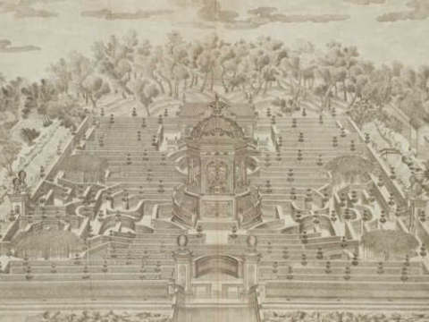

| 位置 | 文件 | 画面 | 性质 |
|---|---|---|---|
| 主图 | `IMG-RUNTIME-MAZE.jpg` | 迷宫意象。不是铜版第四、第五开 | 绘制 |

| 声音 | 条目 |
|---|---|
| 旁白 | `narr-s2-quiz` `narr-s2-quiz-followup` |
| 导览 | `guide-s2-base` `guide-s2-deep`。本站四页共用 |
| 背景音乐 | `bgm-02-huanghuazhen.mp3` |

史料卡 SL-07：迷宫，也称万花阵。装饰有一枚外国邮票贴纸。

## 09 黄花阵 · 名字

`plate21/module/pages/s2-reveal/s2-reveal`

| 位置 | 文件 | 画面 | 性质 |
|---|---|---|---|
| 主图 | `IMG-RUNTIME-LANTERN.jpg` | 宫女持黄绸莲花灯 | 绘制 |

旁白 `narr-s2-reveal` `narr-s2-reveal-followup`。导览、背景音乐与上一页相同。无史料卡。

## 10 黄花阵 · 中心亭

`plate21/module/pages/s2-blend/s2-blend`

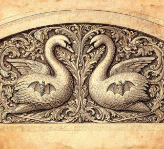

| 位置 | 文件 | 画面 | 性质 |
|---|---|---|---|
| 示意 1 | `IMG-RUNTIME-DETAIL-DOME.jpg` | 穹顶与飞檐 | 绘制 |
| 示意 2 | `IMG-RUNTIME-DETAIL-BEAST.jpg` | 檐角立兽 | 绘制 |
| 示意 3 | `IMG-RUNTIME-DETAIL-LOTUS.jpg` | 莲座与宝瓶 | 绘制 |
| 示意 4 | `IMG-RUNTIME-DETAIL-SWAN.jpg` | 双天鹅与蝙蝠纹 | 绘制 |

旁白 `narr-s2-blend`。导览、背景音乐与第 08 页相同。装饰有 1860 邮戳。无史料卡。

## 11 黄花阵 · 墙纹

`plate21/module/pages/s2-pattern/s2-pattern`

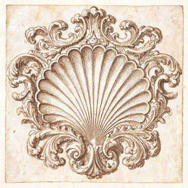

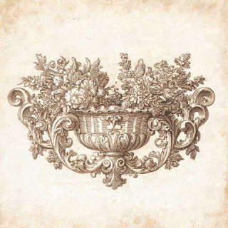

| 位置 | 文件 | 画面 | 性质 |
|---|---|---|---|
| 正确项 | `IMG-RUNTIME-PATTERN-WANZI.jpg` | 万字纹 | 绘制 |
| 干扰 | `IMG-RUNTIME-PATTERN-SHELL.jpg` | 贝壳 | 绘制 |
| 干扰 | `IMG-RUNTIME-PATTERN-SCROLL.jpg` | 卷草 | 绘制 |
| 干扰 | `IMG-RUNTIME-PATTERN-BASKET.jpg` | 花篮 | 绘制 |

| 声音 | 条目 |
|---|---|
| 旁白 | `narr-s2-pattern` `narr-s2-pattern-finale` |
| 台词 | `dlg-huanghuazhen-5` 匠人，`dlg-huanghuazhen-6` 砌墙师傅。人物是编的 |
| 导览、背景音乐 | 与第 08 页相同 |

史料卡 SL-08：1987、1989 年在原址按原样重修，不是乾隆原墙。  
讲解点了铜版第四、第五开（题为花园门北面、花园正面）。这两张图没有贴在这一页上。

## 12 方外观

`waypoint?site=fangwaiguan`

| 位置 | 文件 | 画面 | 性质 |
|---|---|---|---|
| 主图 | `plate-fangwaiguan.jpg` | 铜版《方外观正面》，第 8 开 | 铜版 |

| 声音 | 条目 |
|---|---|
| 旁白 | `narr-waypoint-fangwaiguan` `narr-waypoint-fangwaiguan-followup` |
| 导览 | `guide-t-fangwaiguan-base` `guide-t-fangwaiguan-deep` |
| 背景音乐 | `bgm-03-fangwaiguan.mp3` |

史料卡：SL-09 方外观，SL-10 容妃，SL-11 五竹亭。  
答完的字点了《竹亭北面》。这张铜版没有贴在这一页上。

## 13 海晏堂

`plate21/module/pages/s3-comic/s3-comic`

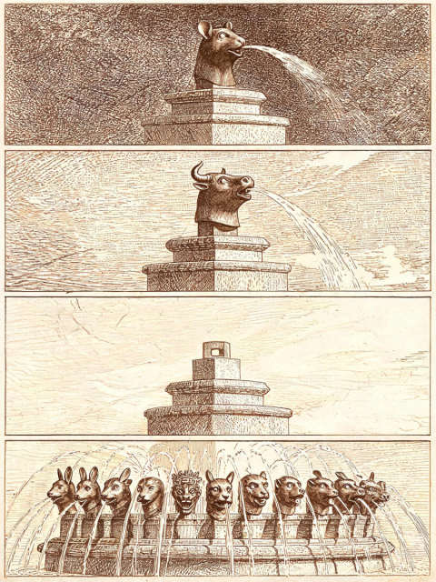

| 位置 | 文件 | 画面 | 性质 |
|---|---|---|---|
| 主图 | `IMG-RUNTIME-COMIC.jpg` | 十二时辰四格 | 绘制 |

| 声音 | 条目 |
|---|---|
| 旁白 | `narr-s3-comic` `narr-s3-comic-followup` |
| 导览 | `guide-s3-base` `guide-s3-deep`。这一段把海晏堂和大水法、兽首回归说在一起 |
| 背景音乐 | `bgm-04-haiyantang.mp3` |

史料卡：SL-12 海晏堂，题后 SL-13 蓄水楼。  
正文写了对照《海晏堂西面》。这张铜版没有贴在这一页上。装饰有植物贴纸。

## 14 蓄水楼

`waypoint?site=xushuilou`

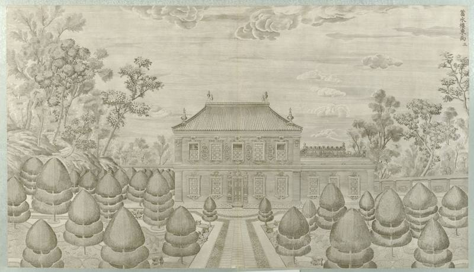

| 位置 | 文件 | 画面 | 性质 |
|---|---|---|---|
| 主图 | `plate-xushuilou.jpg` | 铜版《蓄水楼东面》，第 3 开，谐奇趣西北 | 铜版 |

页面图注写成「海晏堂北面那座」。图上的题不是海晏堂。海晏堂北面是第 11 开，没有贴上。

| 声音 | 条目 |
|---|---|
| 旁白 | `narr-waypoint-xushuilou` `narr-waypoint-xushuilou-followup` |
| 导览 | `guide-t-xushuilou-base` `guide-t-xushuilou-deep`。讲的是海晏堂背面锡海，和主图不是同一座 |
| 背景音乐 | `bgm-10-xushuilou.mp3` |

史料卡：SL-13 两座蓄水楼，SL-04 喷泉原理。

## 15 大水法

`plate21/module/pages/dashuifa/dashuifa`

| 位置 | 文件 | 画面 | 性质 |
|---|---|---|---|
| 主图 | `plate-dashuifa.jpg` | 铜版《大水法南面》，第 15 开 | 铜版 |

| 声音 | 条目 |
|---|---|
| 旁白 | `narr-dashuifa-hunt` `narr-dashuifa-after` `narr-dashuifa-yuan` `narr-dashuifa-followup` |
| 导览 | 无 |
| 背景音乐 | 无。这一页故意不配 |

史料卡：SL-14 大水法，SL-15 观水法，SL-17 雨果。

## 16 雨果

`plate21/module/pages/s4-timeline/s4-timeline`

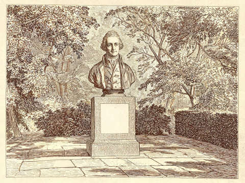

| 位置 | 文件 | 画面 | 性质 |
|---|---|---|---|
| 主图 | `IMG-RUNTIME-HUGO.jpg` | 雨果像。不是 2010 年雕像照片 | 绘制 |

| 声音 | 条目 |
|---|---|
| 旁白 | `narr-s4-timeline` `narr-s4-timeline-mono` |
| 导览 | `guide-s4-base` `guide-s4-deep`。本页和下一页共用 |
| 背景音乐 | `bgm-12-yugao.mp3` |

无 SL 弹层。下落和年份写在页面正文里。装饰有邮戳。

## 17 八位日期

`plate21/module/pages/s4-password/s4-password`

无内容图。装饰：邮戳、吊牌。

旁白 `narr-s4-password`。导览、背景音乐与第 16 页相同。无史料卡。

## 18 终章

`plate21/module/pages/finale/finale`

| 位置 | 文件 | 画面 | 性质 |
|---|---|---|---|
| 拼图底 | `IMG-RUNTIME-PLATE.jpg` | 故事里的第二十一图，不是铜版 | 绘制 |

旁白 `narr-finale-p01` `p02` `p03`。背景音乐 `bgm-06-zhongzhang.mp3`。无导览，无史料卡。装饰：吊牌、植物。

## 19 报告

`plate21/module/pages/report/report`

与终章同一张 `IMG-RUNTIME-PLATE.jpg`，见 `by-page/19-report/plate21.jpg`。

无旁白，无导览，无背景音乐。装饰：长尾夹、票根、下载图标。

## 20 手册

`plate21/module/pages/handbook/handbook`

缩略图仍是 `IMG-RUNTIME-PLATE.jpg`，见 `by-page/20-handbook/plate21.jpg`。

无旁白，无导览，无背景音乐。装饰：票根、英国红便士邮票、回形针。

手册里另有三张旧卡（黄花阵灯会、海晏堂正午、雨果信），不是 SL 弹层。海晏堂那张写的是「马首喷、其余十一首齐喷」，和海晏堂页的「十二首齐喷」不是同一句。

## 21 养雀笼

`waypoint?site=yangquelong`，从手册进。

无内容图。

| 声音 | 条目 |
|---|---|
| 旁白 | `narr-waypoint-yangquelong` `b2` `b3` `end` |
| 导览 | `guide-t-yangquelong-base` `guide-t-yangquelong-deep` |
| 背景音乐 | `bgm-09-yangquelong.mp3` |

无史料卡。

## 22 观水法

`waypoint?site=guanshuifa`，从手册进。

无内容图。

| 声音 | 条目 |
|---|---|
| 旁白 | `narr-waypoint-guanshuifa` `b2` `end` |
| 台词 | `dlg-guanshuifa-1` `dlg-guanshuifa-2`。标成乾隆，只有泽兰堂那半句是引文 |
| 导览 | `guide-t-guanshuifa-base` `guide-t-guanshuifa-deep` |
| 背景音乐 | 无 |

无史料卡。

## 23 线法画

`waypoint?site=xianfahua`，从手册进。

无内容图。

| 声音 | 条目 |
|---|---|
| 旁白 | `narr-waypoint-xianfahua` `b2` `b3` `end` |
| 导览 | `guide-t-xianfahua-base` `guide-t-xianfahua-deep` |
| 背景音乐 | `bgm-11-xianfahua.mp3` |

无史料卡。

## 24 次日之信

`plate21/module/pages/letter/letter`

无内容图，无旁白，无导览。背景音乐 `bgm-13-huixiang.mp3`。

## 25 留言簿

`plate21/module/pages/board/board`

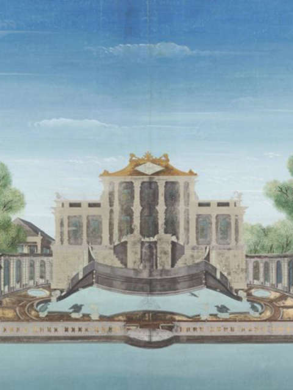

| 长卷上的位置 | 文件 | 画面 | 性质 |
|---|---|---|---|
| 入口 | `IMG-RUNTIME-PROLOGUE-STUDY.jpg` | 档案桌 | 绘制 |
| 黄花阵 | `IMG-RUNTIME-MAZE.jpg` | 迷宫 | 绘制 |
| 海晏堂 | `IMG-RUNTIME-DETAIL-BEAST.jpg` | 其实是中心亭檐角，不是海晏堂，也不是兽首 | 绘制 |
| 雨果 | `IMG-RUNTIME-HUGO.jpg` | 雨果像 | 绘制 |
| 终章 | `IMG-RUNTIME-PLATE.jpg` | 第二十一图 | 绘制 |

无声音，无史料卡。

## 26、27 主线不进的两页

仍在安装包里。`s3-zodiac` 无图，旁白 `narr-s3-zodiac`，另有蒋友仁台词 `dlg-haiyantang-3`。`s3-water` 无图，旁白 `narr-s3-water`，这句说「正午该当班的是马」。两页导览和背景音乐与海晏堂页相同。

## 装饰图

不讲遗址。除封面那枚 1860 邮戳外，不单独送审。

| 页 | 用了哪些 |
|---|---|
| 封面 | 吊牌、1860 邮戳、麦穗、手册图标 |
| 序章以外的走路 | 邮戳、地图钉、对勾 |
| 黄花阵目的 | 邮票 |
| 黄花阵中心亭 | 1860 邮戳 |
| 黄花阵墙纹 | 吊牌、邮票 |
| 海晏堂 | 植物 |
| 雨果、日期、走路 | 邮戳或吊牌 |
| 终章 | 吊牌、植物 |
| 报告 | 长尾夹、票根、下载图标 |
| 手册 | 票根、红便士邮票、回形针 |

人声文件在安装包 `voice-a` 到 `voice-j`，共 104 条。上表「旁白」「导览」「台词」列的是其中这一页会播的。背景音乐在 `bgm/`，无歌词，不进安装包。
