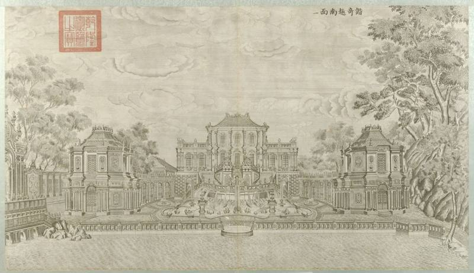
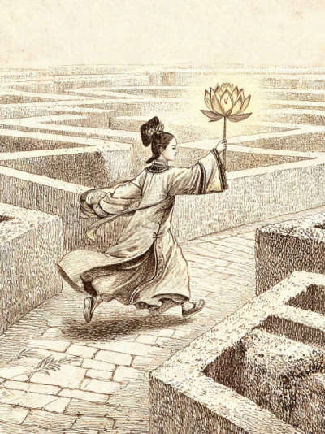
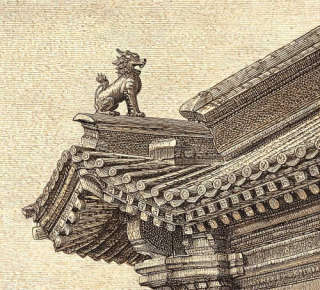
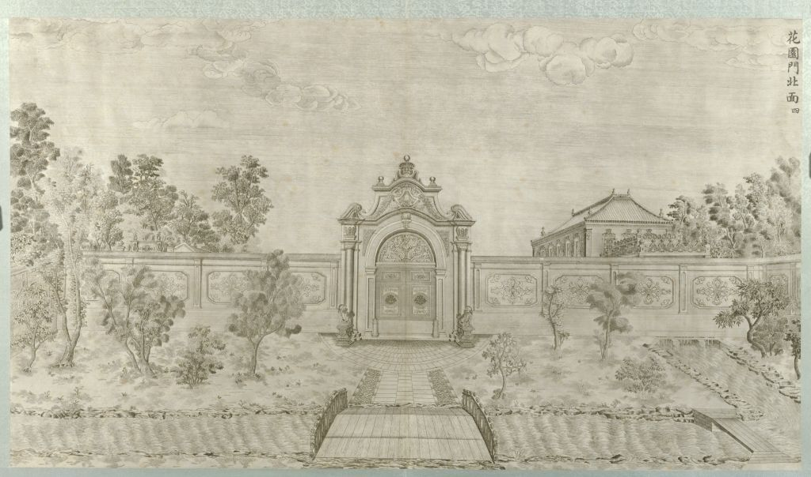
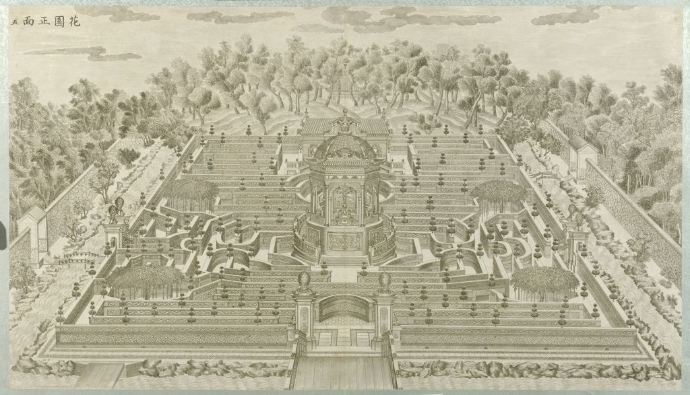
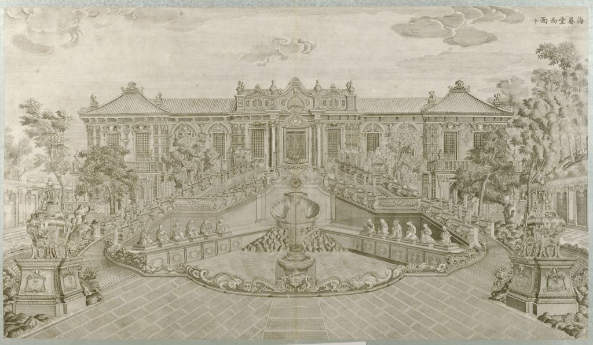

# 西洋楼考察小程序 · 按页面送审

顺序就是游客走进去的顺序。每一节是一页。

一页里只放三样：画面、页面上的字、这一页能听到的。点词弹出的小卡写在那一页下面。出处跟在这句史实后面。

故事里的研究助理、「第二十一图」、民国铅笔补记是虚构。宫女、乐师、匠人的对白是演绎。按钮和回形针不放。

## 1. 门票

没有图。

字：西洋楼铜版图 · 实景解谜。第二十一图 · 完整考察。沿路走一遍：入口、谐奇趣、黄花阵、方外观、海晏堂、蓄水楼、大水法、雨果。

没有讲解。

## 2. 封面

画面是绘制的，不是遗址照片。角上的邮戳是我们画的，日期写着 1860 年 10 月 18 日。请定这个日期能不能留在封面上。

字：书名「西洋楼铜版图」，印「第二十一图」。图下写「闻有第二十一图，未见。」日期章是「乾隆四十六年 / 1781」。1781 是铜版起稿那一年，不是建筑落成的年份。

没有讲解。

## 3. 序章

这一页分四屏，再交到手里。

第一屏。点「西洋楼铜版图」弹出：

> 共二十幅。乾隆四十六年至五十一年（1781–1786），伊兰泰起稿，造办处在北京刻成。故宫藏本亦称《圆明园铜版画》册。没有第二十一幅。

出处：故宫故00009171，<https://www.dpm.org.cn/collection/paint/228650.html>；造办处活计档。

第二屏。页面上还有一句卡片里没有的：「贺清泰、潘廷璋这些在宫里当差的西洋画家也搭过手。」请看这两人要不要出现。已核对的刻版作者是伊兰泰和造办处。

第三屏。这张图是画出来的著录卡，不是馆藏原件。上面的铅笔字「闻有第二十一图，未见」是虚构。

第四屏。引了一句：「水法不过工巧之一端……中国之大，何奇不有。」我们标成乾隆《题泽兰堂》自注。请核对是不是可以这样引。

交到手里的时候有一张路线图，是示意，不是园区地图。

旁白念的就是这四屏上的字。

## 4. 西洋楼入口

没有主图。点「西洋楼」弹出：

> 长春园北部、沿北围墙东西展开的一组欧式楼殿、喷泉和庭园，不是一栋楼。占地约八公顷。

出处：《圆明园研究》第 86 期。请看「约八公顷」用不用。

字：到了入口。门里一条路往东，两边残基看不出当年谁是谁。信在纸上，屏幕不印信的全文。封口半个字，拼出来是「黄花阵」。

旁白：到了门口再拆信。读完去看封口上的半截字。

## 5. 走路

每一段都是同一张路线图，加一句往下走的话。没有新的史实。

- 入口 → 谐奇趣：按照路线图走进入口，就来到了谐奇趣。
- 谐奇趣 → 黄花阵：圈出来的下一处，就是黄花阵。
- 黄花阵 → 方外观：下一站是方外观。
- 方外观 → 海晏堂：五竹亭之后，停在一座很大的水池旁，旁边写着海晏堂。
- 海晏堂 → 蓄水楼：水力钟在眼前，水源在海晏堂北面的高台。
- 蓄水楼 → 大水法：海晏堂用水来报时。再往东是大水法。
- 大水法 → 雨果：下一处是维克多·雨果，《致巴特勒上尉的信》。

## 6. 谐奇趣

画面是铜版《谐奇趣南面》，故宫册第 1 开。没有重画。

页面上的字：这是西洋楼景区建成的第一座欧式建筑，也是中国皇家园林史上首座西洋建筑。主楼前后都曾有水法，这里还曾演奏中西音乐。

点「谐奇趣」弹出的卡只写到：在西洋楼西端南部。乾隆十六年（1751）秋竣工，是西洋楼景区第一座欧式建筑。主楼三层，是演奏中西音乐之处。  
出处：<https://www.yuanmingyuanpark.cn/cgll/zyjd/ccy/201101/t20110105_231511.html>  
「皇家园林史上首座西洋建筑」卡片里没有。请看这半句留不留。

这一页要听完约 30 秒再选题。没有歌词，没有人声，也没有水声。琵琶之后大约 6 秒是小拉琴，再大约 6 秒是西洋箫。不是清宫留下的乐谱。

[听这一段](audio/xieqiqu-30s.mp3)

页面上的题目现在仍把「水声」算进正确答案。这段音乐里没有水。请按没有水声来审。

答完弹出：乾隆时期宫廷已有小拉琴、西洋箫。谐奇趣建成后成为演奏中西音乐、观赏水法的地方。

点「水法」弹出：当时对喷泉的叫法。谐奇趣、海晏堂、大水法都是水法。

这一页还能点开导览。短的说：乾隆十六年秋建成，主楼三层，两侧一边东乐一边西乐。深的说南池原来有铜羊、铜鸭和翻尾石鱼。官网写的是铜燕、铜羊和西洋翻尾石鱼，后来流散到北京大学。请按官网这句审，不要按「铜鸭」。

## 7. 黄花阵 · 这座迷宫是做什么的

画面是绘制的迷宫，不是铜版。黄花阵在铜版里叫「花园」，是第四开、第五开，图在下一页墙纹之后，讲解里会点这两幅的号。

字：一个皇家宫苑里为什么会有迷宫。

答完：每逢中秋之夜，皇帝坐在阵中心凉亭里，看宫女们在迷宫里跑。最先到的得赏。

点「黄花阵」弹出：西洋楼里的迷宫，也称万花阵。  
出处：<https://www.yuanmingyuanpark.cn/cgll/zyjd/ccy/201101/t20110105_231510.html>

旁白念的就是这页的字。

这一页可以点开黄花阵导览。短的：仿欧洲迷宫，墙不过一人高，满刻万字纹；中秋灯会，宫女持黄色彩绸莲花灯，皇帝在圆亭看谁先到。深的：这道墙不是乾隆年间的原墙，1987、1989 年按铜版第四号、第五号重修。阵墙总长一千六百余米，高约 1.2 米，镶卍字雕花青砖。  
「1987 年工地照片，背面写照原图、复位」是故事里的道具，不是管理处公布的那张照片。

## 8. 黄花阵 · 名字从哪来

画面是绘制的宫女提灯，不是文物照片。

字：画上的人提着黄灯。黄花阵的「黄花」，是不是从灯上来的。

答完：宫女手持黄色彩绸扎成的莲花灯，所以迷宫也叫黄花阵。  
官网写的是灯会本身，没有把灯会写成名字的定义。请看「所以得名」这句用不用。

旁白先问灯，答完再念上面这句。

## 9. 黄花阵 · 中心亭

四张都是绘制的示意，让游客举纸对照亭上的东西。不是铜版，也不是现场照片。

字：西式穹顶和中式飞檐在一起；檐角立兽；莲座与宝瓶；双天鹅之间有蝙蝠纹。

旁白：到了中心亭，建筑是中西合在一起的。

导览仍是上一节那套黄花阵导览。

## 10. 黄花阵 · 墙上的纹

四张绘制的纹样。这一路墙上反复出现的是万字纹。另外三张是拿来对照的，不是这道墙上的。

字：走出迷宫。眼前的墙不是乾隆年间留下的原墙。

点「原墙」弹出：现在能走进去的阵墙和中心亭，是 1987、1989 年在原址按原样修复的。  
出处同黄花阵官网页。

铜版第四开、第五开。讲解说重修照的就是这两幅。图上的题是「花园门北面」「花园正面」。

这一页还有两句虚构人物的话。事实只有「1987、1989 年照图重修，对应铜版第四、第五幅」。人是编的。

旁白：把照片翻过来，背面写着「照原图，复位。1987、1989。」这行字是故事道具。

## 11. 方外观

画面是铜版《方外观正面》，第 8 开。

字：现在只剩部分台基和石构。铜版上是两层西式楼、半环形石阶、中式重檐屋顶，内部曾有阿拉伯文碑。题目是选出这三样。

点「方外观」弹出：养雀笼以东。乾隆二十四年（1759）建成。左右有环形石阶。  
出处：<https://www.yuanmingyuanpark.cn/cgll/zyjd/ccy/201101/t20110105_231508.html>  
官网还写了二层西式小楼。卡片没写层数和屋顶，层数和屋顶是对着这张铜版说的。

答完点「容妃」弹出：历史上确有容妃，维吾尔族。「香妃」「体有异香」是民间传说。  
官网写成「容妃（香妃）」。请看讲解里要不要把香妃和史料分开。

接着翻到《竹亭北面》。点「五竹亭」弹出：五座亭子，在方外观对面、隔水相望。乾隆在亭里等候，没有直接史料，记作传说。

导览短的说：乾隆二十四年，礼拜殿，阿拉伯文碑，容妃；香妃是传说。又说「她每次来，乾隆都陪着来」。这一句比卡片更死。卡片标的是传说。请按传说审。

旁白念的是开场那段和容妃、五竹亭。

## 12. 海晏堂

页面要游客对照《海晏堂西面》。这是第 10 开。

字：十二生肖对应十二时辰。日记里有一句：「十二兽各守一时，至午而全见。」

点「海晏堂」弹出：西洋楼最大的一处。正楼朝西，门前弧形石阶环抱喷水池，池左右曾列十二生肖人身兽首。  
出处：<https://www.yuanmingyuanpark.cn/cgll/zyjd/ccy/201101/t20110105_231507.html>

答完：十二生肖按十二时辰依次喷水，正午十二尊一起喷，所以叫水力钟。  
四格画是我们画的，不是水力钟原图。

这一页的导览把海晏堂和大水法说在一起。短的：各报一个时辰，正午十二首齐喷。接着说鼠、牛、虎、兔、马、猴、猪七尊已经归来，其余五尊下落不明。深的还说马首 2019 年捐赠、2020 年 12 月回到正觉寺，并提到蒋友仁。  
正午十二首一起喷，与官网一致。七尊的名单和马首那几句，请管理处给现在能讲的一句，不要用我们写的数字。蒋友仁参与水法、乾隆三十九年在北京去世，这句用不用也请定。

旁白念开场、日记那句，以及答完去北面高台。

## 13. 蓄水楼

画面是铜版《蓄水楼东面》，第 3 开，谐奇趣西北那座。

页面说明现在写着：「档案里的《蓄水楼东面》——海晏堂北面那座。」图上的题是蓄水楼东面，画的不是海晏堂北面。海晏堂北面工字楼是第 11 开，这页没有贴那张。请按图上的题审：这一张是谐奇趣西北的蓄水楼。

正文想讲的是另一座：海晏堂北面高台，锡海，不是谐奇趣西北那座。题目是蓄水楼为了供水通常建得比较高还是比较低。答案是高。

点「蓄水楼」弹出：供给喷泉用水的楼。谐奇趣西北有一座；海晏堂后面工字楼的锡海是另一座。  
出处：官网谐奇趣页；官网海晏堂页。海晏堂页写锡海一次可蓄水一百六十余立方米。

点「喷泉原理」弹出：没有电泵。水先送到高处，再用高度差变成水压。谁把水提上去，不选一种说法。

导览讲的是海晏堂背面这座锡海，和屏幕上这张第 3 开不是同一座。请分开听：导览的数字可以审，图不要听成海晏堂。

## 14. 大水法

画面是铜版《大水法南面》，第 15 开。图上的题就是大水法南面。

字：石构还在，只看现在很难想象当年。铜版和眼前的轮廓对得上。喷水池里有鹿，周围是别的动物。

点「大水法」弹出：西洋楼最大的喷泉。主建筑是巨型石龛，前面有喷水池。石龛和前面三座喷水池还在。  
出处：<https://www.yuanmingyuanpark.cn/cgll/zyjd/ccy/201101/t20110105_231505.html>

要摆的位置：梅花鹿在池中央，猎狗环绕，卷尾铜兽在水池东西两端。与官网「猎狗逐鹿」一致。

往北看远瀛观，往南是观水法。从北到南：远瀛观、大水法、观水法，一条轴，不是三个下一站。

点「观水法」弹出：在大水法对面。坐南朝北的平台和宝座，是皇帝看喷泉的地方。后面有石屏。  
出处：<https://www.yuanmingyuanpark.cn/cgll/zyjd/ccy/201101/t20110105_231504.html>

远瀛观：大水法北侧高台上，乾隆四十八年（1783）添建。  
出处：<https://www.yuanmingyuanpark.cn/cgll/zyjd/ccy/201101/t20110105_231506.html>

点「雨果」弹出：1861 年在法国写《致巴特勒上尉的信》。他本人没来过圆明园。

这一页没有配乐。旁白就是上面从大水法走到远瀛观、观水法、再走向雨果的几句。

## 15. 雨果雕像

画面是绘制的雨果像，不是 2010 年雕像的照片。

字：1861 年，焚毁后的第二年，他在法国写下这封信，谴责劫掠和焚毁。他没来过。雕像立在遗址旁。

五张年份卡片，排成：1747 西洋楼开始建造，1760 前后一批主要景观形成，1860 被焚毁，1861 这封信，2010 雕像落成。

四件东西的下落，写在这一页：

- 观水法石屏风，曾搬进城里私园，1977 年运回原址。称第一件完整回归的流失文物。请定这句还能不能用。
- 翻尾石鱼，谐奇趣南池那条，现在北京大学未名湖西侧。官网只写到北京大学。请定能不能写未名湖。
- 七根汉白玉石柱，在挪威一百多年，2023 年回来。请给定哪一年、哪一句。
- 铜鹿和十只铜狗，1860 年之后没有下落，石座还在。请定能不能这样说。

导览会念信里的一句：「两个强盗闯进了圆明园。一个叫法兰西，一个叫英吉利。」并说明这是文学说法，不是现场记录。2010 年雕像、法国雕塑家娜什拉·凯努无偿创作，请给定稿用词。

旁白念的是 1861 年写信、人没来过，以及排完年份再读信。

## 16. 八位日期

没有新的图，也没有新的史实。八张卡片角上的数字连起来是这次考察的日期。旁白说这是加料，不是门。

## 17. 终章

画面是我们画的一幅长卷，故事里叫「第二十一图」。不是第二十一幅铜版。

字：乾隆时期的二十幅记录的是建成时的样子。后来的事不在那二十幅里。中间空着，印「此处待绘」。留下「第二十一图」这个传闻，是为了让来的人把自己看到的记下来。

旁白念的就是这几句。

## 18. 考察报告

同一幅「第二十一图」，给游客保存。没有新的史实。

## 19. 考察手册

三张可以再翻开的卡。

黄花阵：又称万花阵。中秋之夜，宫女持黄色彩绸莲花灯，皇帝在中心亭看，先到的得赏。

海晏堂：这一张写成「正午马首喷水，其余十一兽首一同喷水」，又写七尊已经回归。海晏堂那一页和官网都是正午十二首一起喷。请以十二首一起喷为准。七尊的名单同样请管理处定。

雨果：2010 年雕像落成。信里那句「两个强盗」。

手册里还能进三处散页，见下。

## 20. 养雀笼

从手册进。没有铜版主图。

字：东面石门还在，西面木头的那一半没有了。同一座建筑，一半留下来了，一半没有。

导览：约在谐奇趣东边，中间是过道，两侧原来养孔雀和珍禽。东面西洋石门，西面中式牌楼已毁。约乾隆二十四年。  
出处：<https://www.yuanmingyuanpark.cn/cgll/zyjd/ccy/201101/t20110105_231509.html>

## 21. 观水法

从手册进。没有单独的铜版主图。大水法那一页已经讲过位置。

字：坐南朝北的平台和宝座。喷泉在南，宝座在北。乾隆五十八年英国使团、六十年荷兰使臣，被安排在这里瞻仰水法。写的是「曾安排」，没写谁在椅子上坐过。

石屏五件，刻西洋军旗、刀剑、枪炮。出处即观水法官网页。

这一页有一段标成乾隆的话。只有「水法不过工巧之一端……中国之大，何奇不有」是引文。前后「坐这儿」「领他们看」是演绎。

## 22. 线法画

从手册进。没有铜版主图。

字：几排砖墙基址往里收，中间一条直路。用西洋透视把风景画在墙上。现在墙没有了，方河清整过，种了荷。

出处：<https://www.yuanmingyuanpark.cn/cgll/zyjd/ccy/201101/t20110105_231502.html>  
官网是方河东岸七道八字断墙。导览深讲另引《圆明园研究》第 86 期「两列十一面」。请定对游客讲哪一句，我们不把两句说成同一个数。

## 23. 次日之信、留言簿

通关次日才能进。画面重复前面用过的绘制图，没有新的铜版。留言簿上多一句：七根石柱流散挪威百余年，2023 年回了家。这句话请和第 15 页的石柱一起定。

信和留言的其余句子是故事和游客自己写的，不送审。
