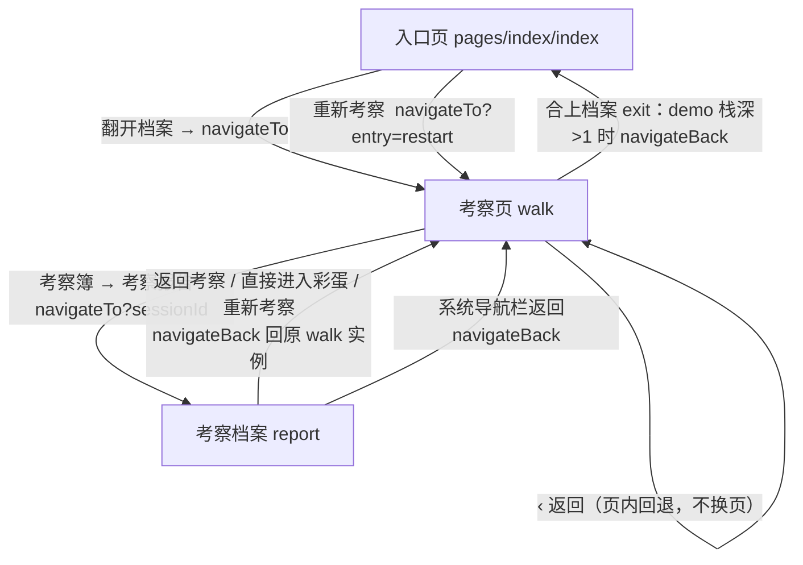
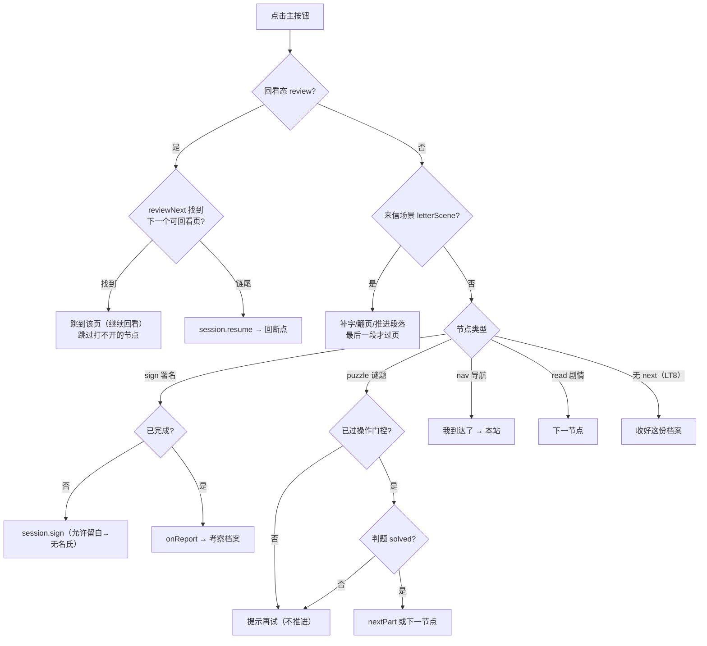
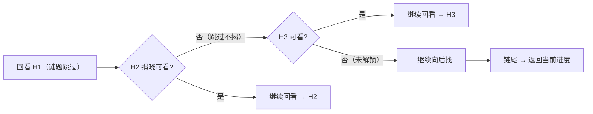

# 游戏模块跳转流程图（v3）

> 本文档描述 `feat/game-module-v3` 的页面跳转与按钮行为，供开发与核对使用。
> 更新：2026-09-26（含回看前进修复）。验证基线：`npm test` 159 项 + 微信开发者工具模拟器实测。

## 一、页面栈（微信页面级跳转）

要点：
- report 的三个出口统一 `navigateBack` 回到**原 walk 实例**（无来路时才 `redirectTo` 兜底），不再压入重复 walk 页。
- 系统返回链：`report → walk → index`，共两层，无重复页。

## 二、46 节点主线与跳过线

实线 = `next`（继续）；虚线 = `skipTo`（“跳过/这次不去”）。

```mermaid
flowchart TD
    subgraph 序章
    P1["P1 传闻"] --> P2["P2 求证"] --> P3["P3 资料"]
    end
    subgraph 西洋楼入口
    E1{"E1 辨认方向<br/>quiz-direction"} --> E2["E2 走进西洋楼"]
    end
    subgraph 谐奇趣
    M1["M1 导航"] --> X1{"X1 听声<br/>listen-nfc"} --> X2{"X2 信封<br/>quiz-envelope"} --> X3["X3 揭晓"]
    end
    subgraph 黄花阵
    M2["M2 导航"] --> H1{"H1 迷宫用途<br/>quiz-lantern"} --> H2["H2 灯会<br/>揭晓"] --> H3{"H3 名字<br/>prop-flip"} --> H4{"H4 观察<br/>photo-pavilion"} --> H5{"H5 花纹<br/>quiz-pattern"} --> H6["H6 寓意"]
    end
    subgraph 方外观
    M3["M3 导航"] --> F1["F1 方外观"] --> FQ1{"FQ1 人物<br/>quiz-fang-person"} --> FQ2{"FQ2 用途<br/>quiz-fang-use"} --> FR1["FR1 生活"] --> F2["F2 五竹亭"]
    end
    subgraph 海晏堂
    M4["M4 导航"] --> HY1{"HY1 水力钟<br/>quiz-hour"} --> HY2["HY2 水流"] --> HY3{"HY3 转盘<br/>prop-dial"}
    end
    subgraph 蓄水楼与大水法
    M5["M5 导航"] --> XS1{"XS1 线索<br/>quiz-height"} --> XS2["XS2 工程"] --> M6["M6 导航"] --> DS1{"DS1 复原水法<br/>place-animals"} --> DS2["DS2 眼前遗址"]
    end
    subgraph 雨果与收尾
    M7["M7 导航"] --> HG1["HG1 雨果"] --> FN1["FN1 浮现"] --> FN2["FN2 留信"] --> FN3["FN3 记录"] --> FN4["FN4 署名<br/>sign"]
    end
    subgraph 次日来信
    LT1["LT1"] --> LT2 --> LT3 --> LT4 --> LT5 --> LT6["LT6 接力"] --> LT7["LT7 投稿"] --> LT8["LT8 收档"]
    end

    E2 --> M1
    X3 --> M2
    H6 --> M3
    F2 --> M4
    HY3 --> M5
    XS2 --> M6
    DS2 --> M7
    FN4 --> LT1

    P1 -. skip .-> E1
    P2 -. skip .-> E1
    P3 -. skip .-> E1
    E1 -. skip .-> E2
    M1 -. 这次不去 .-> M2
    X1 -. skip .-> X2
    X2 -. skip .-> M2
    M2 -. 这次不去 .-> M3
    H1 -. skip .-> H3
    H3 -. skip .-> H4
    H4 -. skip .-> H5
    H5 -. skip .-> M3
    M3 -. 这次不去 .-> M4
    FQ1 -. skip .-> FQ2
    FQ2 -. skip .-> F2
    M4 -. 这次不去 .-> M5
    HY1 -. skip .-> HY3
    HY3 -. skip .-> M5
    M5 -. 这次不去 .-> M6
    XS1 -. skip .-> M6
    M6 -. 这次不去 .-> M7
    DS1 -. skip .-> M7
    M7 -. 这次不去 .-> FN1
```

门控（`engine.canEnter`）：
- `LT*` 来信节点：需**完成考察**且**来信已开放**（次日/彩蛋入口）
- 揭晓节点（H2、X3 等 `revealOf`）：需对应谜题 **solved/assisted**（跳过者不揭答案）
- 其余节点：需 `unlocked` 或 `visited`

## 三、按钮 → 行为映射

| 页面 | 按钮 | 处理函数 | 行为 |
|---|---|---|---|
| index | 翻开档案 → | `onStart` | `navigateTo walk` |
| index | 重新考察 | `onRestart` | `navigateTo walk?entry=restart`（walk 显示重启确认屏） |
| walk | ‹ 返回 | `onBack` | **页内回退**：先上一屏（part），再上一个可进入节点（进回看态） |
| walk | 继续 / 确认答案 / 我已翻到背面 / 听完了，继续 / 保存观察记录 / 我已到达了 等 | `onPrimary` | 见下方决策图（按节点类型分派） |
| walk | 这题先跳过 / 这次不去 / 先去园里 | `onSkip` | `session.skipPage` → `skipTo` 目标（无 skipTo 走 next） |
| walk | 考察簿 ☰ | `onDrawer` | 打开抽屉（进度/史料/设置），无页面跳转 |
| walk | 进度行（继续/回看） | `onOpenPage` | `session.navigate(id)`（仅解锁节点），页内切换 |
| walk | 回到当前进度 | `onResume` | `session.resume` → 断点 `resumePageId` |
| walk | 考察报告（作品按钮/已完成档案） | `onReport` | `navigateTo report?sessionId` |
| walk | 重新考察 | `onRestart` | 页内重启确认屏（取消保留进度） |
| walk | 合上档案 | `onExit` | `session.exit`；demo 栈深>1 `navigateBack`，否则提示 |
| walk | 直接进入彩蛋 | `onOpenBonus` | `session.openBonus`，页内推进到来信 |
| report | 返回考察 | `onReturn` | `navigateBack` 回原 walk（无来路 `redirectTo` 兜底） |
| report | 直接进入彩蛋 / 来信按钮 | `onOpenBonus` / `onOpenLetter` | 开信后 `navigateBack` 回 walk（`entry=letter` 语义） |
| report | 重新考察 | `onRestart` | `navigateBack` 回 walk + 触发重启确认屏 |
| letter-scene | 下一段 / 补全文字 / 继续 | `onNext` | 场景内推进（打字机/段落），无页面跳转 |

## 四、主按钮（onPrimary）决策图

## 五、2026-09-26 修复：回看前进不再“跳到最后”

**现象**：跳过黄花阵的谜题后回看该段，点主按钮直接跳到来信/最后。

**根因**：`engine.reviewNext` 在遇到打不开的节点（被跳过谜题的**揭晓节点**，如 H2 是 H1 的 `revealOf`；或未解锁的站内页）时提前返回空 → `onPrimary` 回看分支落到 `session.resume`（断点=最后完成处）。

**修复**：`reviewNext` 跳过打不开的节点**继续向后找下一个可回看页**；只有真正回看到链尾才走“回到当前进度”。主按钮随之始终显示“继续回看”（找到下一页时）。

