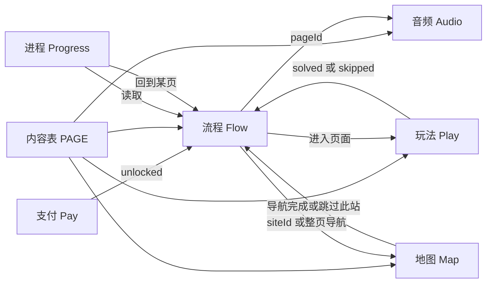
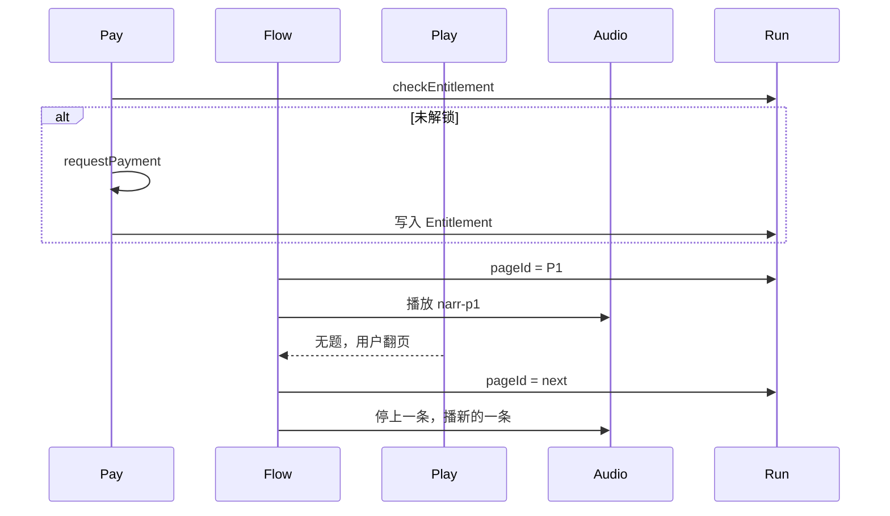
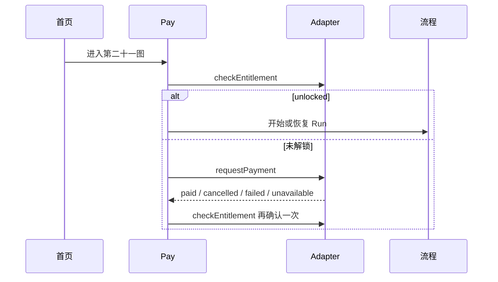

# 主线模块技术设计

状态：设计稿。定支付、流程、地图、音频、玩法、进程怎么接。每一页的字、图和玩法以 `docs/飞书分页接入方案.md` 为准（飞书《第廿一图》v3 revision 5614）。
当前代码仍是 V2 四站加门票门页。本文描述要接入的目标，不表示已经做完。

## 1. 模块

运行时 **6 个独立模块**。跳转不是第七个模块，它是流程模块里的一张表。各个点的谜题也不是各写一套流程，而是玩法模块下的多个实现，共用同一个完成 / 跳过接口。

| 模块 | 职责 | 不做什么 | 现有代码 |
|---|---|---|---|
| 支付 Pay | 进园前鉴权。未解锁停在门页，解锁后放行 | 不读剧情，不导航 | `pages/gate`、`adapters` 的 `requestPayment` / `checkEntitlement` |
| 流程 Flow | 决定现在在哪一页、完成或跳过后去哪一页 | 不画地图，不播声音，不判题 | 现有 `progress-flow.js` 仍是四站，要换成页表 |
| 地图 Map | 8 个点的坐标、距离、导航。站间整页，站内侧边按钮 | 不放剧情句，不画纸质路线图，不判题 | `site-geo.js`、`map-drawer`。点位还是 4 个，抽屉还不能代替走路页 |
| 音频 Audio | 按页号播一条旁白。翻页或跳过就停 | 不决定下一页。走路页不播 | `audio-src.js`、`voice_manifest.json`。主线旁白尚未按新页号录 |
| 玩法 Play | 只负责一道题：提示实体道具、收集操作、给出 solved 或 skipped | 不写下一页地址，不播揭晓旁白 | 现有各页题型可迁，但不能再自己 `redirectTo` |
| 进程 Progress | 随时打开的进程页。读状态，跳回某一站或某一题 | 不改剧情原文 | 尚无这一页。封面的「继续」只是断点，不是进程页 |

内容表 `PAGE` 是数据，不是模块。流程、音频、玩法、地图都只读它。



## 2. 页面从哪来

一页一条记录。编号与接入方案相同：`P1`–`P3`、`E1`–`E2`、`M1`–`M7`、`X1`–`X3`、`H1`–`H6`、`F1`–`F2`、`HY1`–`HY3`、`XS1`–`XS2`、`DS1`–`DS2`、`HG1`、`FN1`–`FN4`、`LT1`–`LT4`。

```text
Page
  id            页号
  kind          read | puzzle | nav | sign | letter
  siteId        空，或 gate / xieqiqu / maze / fangwaiguan / haiyantang / xushuilou / dashuifa / hugo
  lines         飞书原句。道具编号不上屏
  narrId        narr-<页号>，nav 与 FN4 为空
  image         无，或接入方案「哪一页有图」里的那一种
  propPrompt    空，或一句提示。不带图片
  playId        空，或下面的玩法编号
  revealOf      空，或它揭晓的那道题。题被跳过则本页不进入
  next          正常完成去哪一页
  skipTo        跳过去哪一页。只对序章整段、走路页、谜题页有值
```

玩法编号：`quiz-direction`、`listen-nfc`、`quiz-envelope`、`quiz-lantern`、`prop-flip`、`photo-pavilion`、`quiz-pattern`、`quiz-hour`、`prop-dial`、`quiz-height`、`place-animals`。

## 3. 数据存在哪

会话一条。支付权益和游园进度分开放，退款或未解锁不能靠本地页号混进去。

```text
Entitlement
  unlocked          bool
  sku               plate21_full
  entitlementId

Run
  pageId            当前页
  sites             每个 siteId：idle | skipped | active | done
  puzzles           每个 playId：pending | skipped | solved
  editionNo         署名时才写
  signedAt          署名时间。次日信只看这个日期
```

流转规则：

- 支付成功只写 `Entitlement`。流程从 `P1` 开始，不在支付回调里写页号。
- 进入点位页：该 `siteId` 标 `active`。
- 玩法返回 `solved`：对应题标 `solved`，流程走 `next`。
- 玩法返回 `skipped`：题标 `skipped`，流程走 `skipTo`，不进入 `revealOf` 等于这道题的页。
- 走路页选择不去：`siteId` 标 `skipped`，流程走下一段导航，不进入该站任何正文页。
- 一个站的正文页走完，或该站被整站跳过：`siteId` 标 `done` 或保持 `skipped`。
- 音频模块只读 `pageId` 对应的 `narrId`。跳过的页不播。
- 进程页只读 `Run`。它要去某一站时，不自己拼地址，把目标页号交给流程。



宿主适配器保持现在的契约：`checkEntitlement()`、`requestPayment({ sessionId, sku })`。本地适配器继续可以模拟 `paid`。模块不直接调用 `wx.requestPayment`。

## 4. 跳转

正常顺序就是接入方案里的那一条链。这里只写分支。

```mermaid
flowchart TD
  Pay[门页] -->|已解锁| P1
  P1 -->|跳过序章| E1
  P1 --> P2 --> P3 --> E1
  E1 -->|跳过方位题| E2
  E1 -->|答对| E2
  E2 --> M1
  M1 -->|不去谐奇趣| M2
  M1 --> X1
  X1 -->|跳过贴片| X2
  X1 --> X2
  X2 -->|跳过信封| M2
  X2 -->|答对| X3 --> M2
  M2 -->|不去黄花阵| M3
  M2 --> H1
  H1 -->|跳过| H3
  H1 -->|答对| H2 --> H3
  H3 -->|跳过翻图| H4
  H3 --> H4
  H4 -->|跳过拍照| H5
  H4 --> H5
  H5 -->|跳过花纹| M3
  H5 -->|答对| H6 --> M3
  M3 -->|不去方外观| M4
  M3 --> F1 --> F2 --> M4
  M4 -->|不去海晏堂| M5
  M4 --> HY1
  HY1 -->|跳过时辰| HY3
  HY1 -->|答对| HY2 --> HY3
  HY3 -->|跳过转盘| M5
  HY3 --> M5
  M5 -->|不去蓄水楼| M6
  M5 --> XS1
  XS1 -->|跳过| M6
  XS1 -->|答对| XS2 --> M6
  M6 -->|不去大水法| M7
  M6 --> DS1
  DS1 -->|跳过归位| M7
  DS1 -->|完成| DS2 --> M7
  M7 -->|不去雨果| FN1
  M7 --> HG1 --> FN1
  FN1 --> FN2 --> FN3 --> FN4
  FN4 -->|次日| LT1 --> LT2 --> LT3 --> LT4
```



约束：

- 玩法文件里禁止写死下一页地址。只返回 `solved` 或 `skipped`。
- 揭晓页不单独提供跳过。它是否出现，由上一题的结果决定。
- 结局 `FN` 和次日 `LT` 没有跳过按钮。离开用进程页，回来仍从 `Run.pageId` 进入。
- `LT1` 只有 `signedAt` 的日期早于今天才能进。当天署名完停在 `FN4`。

## 5. 各模块怎么接

### 5.1 支付



`unavailable` 隐藏购买按钮。`cancelled` 和 `failed` 留在门页，不写页号。

### 5.2 地图

`site-geo.js` 的点改成 8 个：`gate`、`xieqiqu`、`maze`、`fangwaiguan`、`haiyantang`、`xushuilou`、`dashuifa`、`hugo`。远瀛观、观水法、五竹亭不单开点。蓄水楼用海晏堂北面的坐标。

| 场景 | 界面 | 数据 |
|---|---|---|
| `kind = nav` 的 M1–M7 | 整页。当前点、下一点、距离、开始导航、不去了 | 读 `siteId` 与下一站。导航走现有 `openNavigation` |
| 点位页、结局页、次日页 | 侧边小按钮，点开同一张图 | 只读，不改 `pageId` |
| 序章 P1–P3 | 没有地图按钮 | 人还没进园 |

纸质地图只在 `E1` 用一句话提示。整页导航不使用那张图的照片。

### 5.3 音频

进入页面时，流程把 `narrId` 交给音频模块。音频模块停掉上一条，再播这一条。

| 页种类 | 播什么 |
|---|---|
| `read` / `puzzle` / `letter` | `narr-<页号>`，只念原文 |
| 揭晓页 | 只有没被跳过才进入，所以会播 |
| `nav`、`FN4` | 不播 |
| 跳过的页 | 不进入，所以不播 |
| X1 的贴片 | 另有一条声景，不占用 `narr-x1`。旁白念完到站句后再播声景 |

生成清单就是接入方案里的 `narr-p1`、`narr-p2`、`narr-p3`，以及 `narr-e*`、`narr-x*`、`narr-h*`、`narr-f*`、`narr-hy*`、`narr-xs*`、`narr-ds*`、`narr-hg1`、`narr-fn1`–`narr-fn3`、`narr-lt1`–`narr-lt4`。走路页没有文件。

### 5.4 玩法

每道题一个纯函数界面：

```text
start(page, run) -> 屏上需要的提示和控件
submit(action) -> solved | skipped | again
```

`again` 只表示还没做完，流程不跳页。实体道具只出现在 `propPrompt`，组件内部不再放道具图。

| playId | 页 | 完成 | 跳过 |
|---|---|---|---|
| `quiz-direction` | E1 | 选东北 | 不显示东北 |
| `listen-nfc` | X1 | 贴片声景播完 | 不进「如此悠扬」的单独揭晓句；X2 仍可去 |
| `quiz-envelope` | X2 | 填黄花阵 | 不进 X3 |
| `quiz-lantern` | H1 | 选中秋灯会 | 不进 H2 |
| `prop-flip` | H3 | 确认已翻开 | 不念莲花灯那句，去 H4 |
| `photo-pavilion` | H4 | 四处里拍到一处 | 去 H5 |
| `quiz-pattern` | H5 | 选万字纹 | 不进 H6 |
| `quiz-hour` | HY1 | 羊、马 | 不进 HY2 |
| `prop-dial` | HY3 | 确认已用转盘 | 仍去 M5，后三句可念 |
| `quiz-height` | XS1 | 选高 | 不进 XS2 |
| `place-animals` | DS1 | 三组归位 | 不进 DS2 |

方外观、雨果没有 `playId`。不想去，在 M3、M7 整站跳过。

### 5.5 进程

侧边与地图按钮并列。点开是一页，不是抽屉。

读 `Run.sites` 和 `Run.puzzles`，展示：还没到、这次没去、进行中、已看完；题是未做、跳过、完成。

点某一项时只发一个页号给流程，例如「回到黄花阵」发出 `M2`，「重做花纹」发出 `H5`。进程页不调用 `wx.navigateTo`。

### 5.6 流程

流程是唯一允许改 `pageId` 的地方。伪代码：

```text
onComplete(page):
  若 page 是某站最后一页，sites[siteId] = done
  go(page.next)

onSkip(page):
  若 page.kind 是 nav：sites[目标站] = skipped，go(下一段 nav 或 FN1)
  若 page 有 playId：puzzles[playId] = skipped，go(page.skipTo)
  若 page 是 P1：go(E1)

onEnter(page):
  若 page.revealOf 的题是 skipped：改走那一题的 skipTo，不渲染本页
  若 page.siteId 不为空且不是 skipped：sites[siteId] = active
  把 narrId 交给音频
```

恢复进度时读 `Run.pageId`。没有页号才从 `P1` 开始。门页不保存剧情页号。

## 6. 和现在仓库的差别

| 现在 | 接入后 |
|---|---|
| 四站：入口、黄花阵、海晏堂、雨果 | 八个点，中间有谐奇趣、方外观、蓄水楼、大水法 |
| 各页自己 `redirectTo` | 只返回 solved / skipped |
| 地图是侧边抽屉，点位只有 4 个 | 站间整页，站内仍用抽屉按钮 |
| 旁白按旧页号，且主线静音 | 按本文页号重新生成 |
| 没有进程页 | 侧边进入进程页 |

支付适配器、`openNavigation`、侧边抽屉组件留下。四站页表和各页里的跳转地址换掉。
