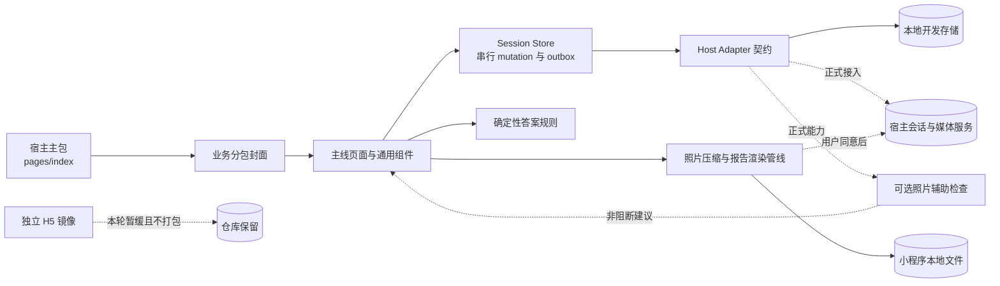
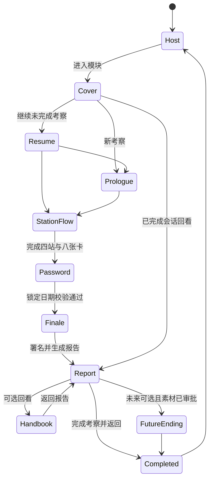
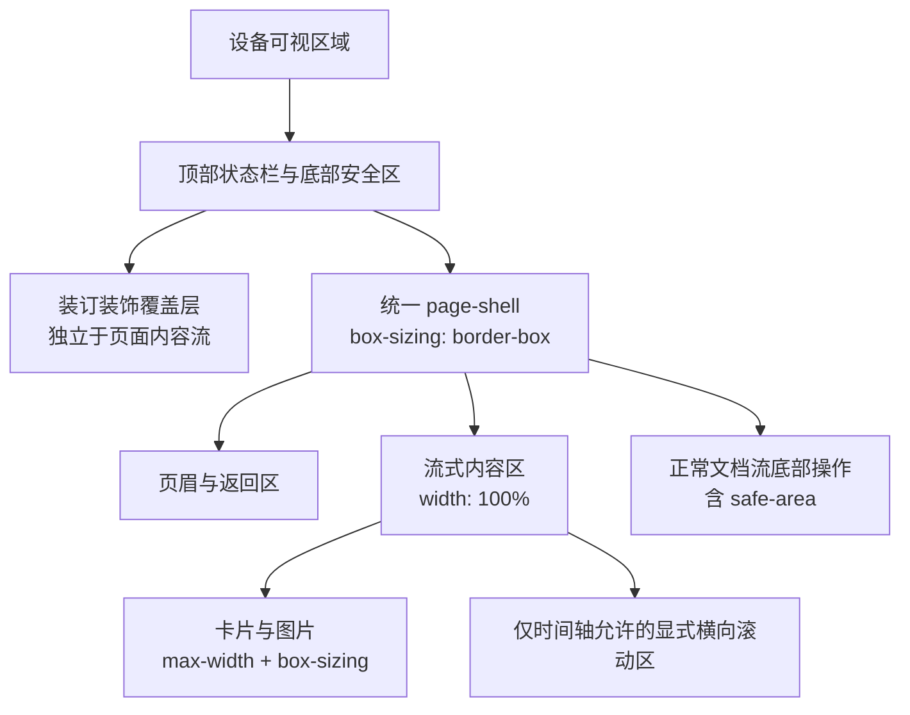
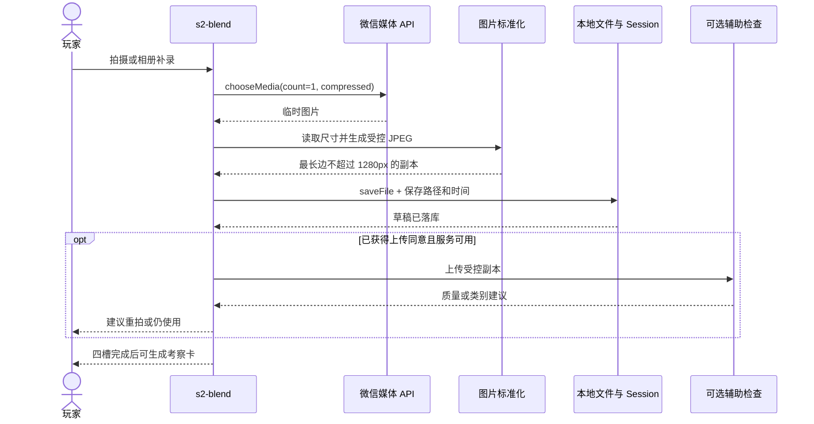
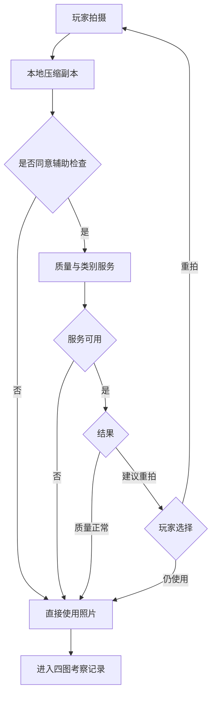
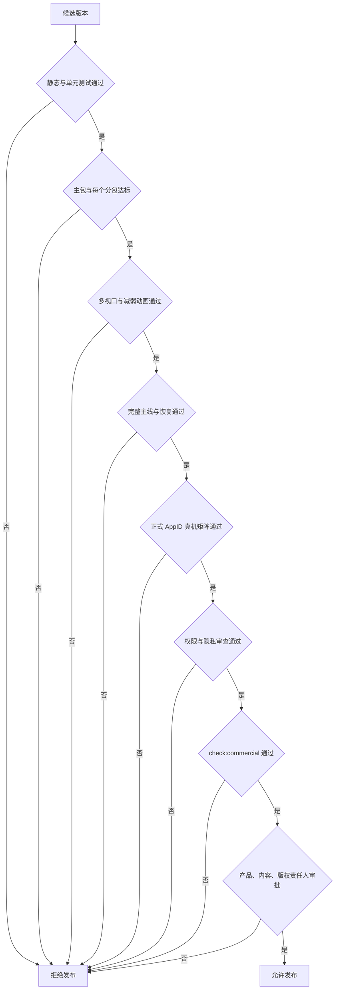

# 《西洋楼铜版图·第二十一图》小程序维护优化技术方案 v2.0

| 项目 | 内容 |
|---|---|
| 文档版本 | v2.0-implemented.2 |
| 编制日期 | 2026-08-11 |
| 文档状态 | 代码侧 P0/P1/P2 与图片商业门禁已关闭；待外部真机与发布审批 |
| 适用工程 | `D:/kc/ymy` |
| 主要范围 | 原生微信小程序主包与 `plate21/module` 业务分包 |
| 暂缓范围 | 独立 `h5/` 正式化与功能同步 |
| 产品决策 | 小程序优先；照片识别仅作非阻断辅助；报告页可直接完成体验 |
| 剧情基线 | 飞书 revision `2174` 的本地验收镜像 |
| 关联文档 | [`剧情玩法验收矩阵-rev2174.md`](./剧情玩法验收矩阵-rev2174.md)、[`项目完整修复优化计划-飞书剧情对齐.md`](./项目完整修复优化计划-飞书剧情对齐.md)、[`UI-UX设计文档.md`](./UI-UX设计文档.md)、[`v1.5.0-实体道具引导规格.md`](./v1.5.0-实体道具引导规格.md) |

> 本文档是 2026-08-11 全量审计后的实施规格与结果记录。MINI-001 至 MINI-020 的可由代码关闭部分均已实施；语音、识别、视频、正式 AppID、真机性能和实体物料说明仍按外部依赖处理。

### 实施结果摘要

| 项目 | 2026-08-11 结果 |
|---|---|
| 生产路由 | 17 条：主包 1，业务分包 16；`ending` 源码保留但不注册、不打包 |
| 自动化 | `npm test` 90 项通过；静态检查 `syntax=83 json=39 routes=17` |
| 视觉台架 | 31 个页面/关键状态、0 个 JS 错误；三类视口无意外横向溢出 |
| 包体 | 主包 `0.23 MiB`，分包 `1.26 MiB`，总计 `1.48 MiB` |
| 商业图片 | 59 个受控路径：41 个 AI 源文件 ignored，18 个 approved 生产衍生图 bundled；`holds=0 mode=commercial` |
| 运行时动画 | CSS/有限状态；Anime.js vendor 与封装排除出包 |
| 主线终点 | 报告页直接完成，`flags.experienceCompletedAt` 幂等持久化 |

---

## 目录

1. 文档目标
2. 范围与非目标
3. 当前基线与审计结论
4. 目标架构与设计原则
5. 问题台账
6. 详细技术方案
7. 文件改动矩阵
8. 实施批次
9. 测试与验证方案
10. 性能预算
11. 安全、隐私与合规
12. 发布门禁
13. 风险与回滚
14. 外部依赖与待确认事项
15. 完成定义
16. 变更记录

---

## 1. 文档目标

本轮不是继续叠加页面效果，而是把现有小程序维护到可稳定迭代、可真机验收、可明确判断是否能够商业发布的状态。

具体目标如下：

1. 消除小屏、短屏、系统减弱动画和低性能设备上的文字不可见、内容裁切、横向溢出与卡顿。
2. 建立报告页直接完成、完成态持久化、再次进入可回看报告的闭环。
3. 统一会话锁定日期、答案规范化与实体道具结果校验口径。
4. 将逐帧跨线程数据更新改为 CSS 或有限状态更新，降低时间轴、终章和报告导出的性能风险。
5. 修复当前主包错误包含 PDF、H5 和演示 HTML 的问题，并建立主包、分包、总包的自动门禁。
6. 明确照片识别、语音和视频属于外部能力，不以恒通过 Mock 或空素材冒充正式实现。
7. 对图片、字体、第三方代码建立可追溯的商业放行条件。

本文档采用以下术语：

| 术语 | 含义 |
|---|---|
| P0 | 阻断主流程、稳定性、包体或商业发布，必须优先处理 |
| P1 | 影响核心体验、性能或可访问性，应在正式真机验收前处理 |
| P2 | 外部能力或后续增强，不阻断当前小程序主线维护 |
| 硬门禁 | 未满足时构建或商业检查必须返回非零退出码 |
| 项目目标 | 比平台上限更严格的内部预算，用于防止持续回退 |
| 锁定日期 | `SessionSnapshot.sessionDate`，在会话创建时写入，跨午夜不变化 |

---

## 2. 范围与非目标

### 2.1 本轮范围

- 宿主首页 `pages/index/index`。
- `plate21/module` 中当前主线页面、组件、会话状态、Adapter 和资源。
- `project.config.json`、`app.json`、根级测试命令和包体报告。
- 文字答案、实体转盘、水显纸、四图拍摄、时间轴、终章、报告和手册。
- 小程序运行时使用的已授权 AI 衍生图、项目自制辅助图形、字体、图标、CSS 动画和商业资源锁。
- Node 单元测试、WXML/WXSS H5 台架、微信开发者工具自动化与真机矩阵。

### 2.2 本轮非目标

- 不同步重构独立 `h5/app.js` 与 `h5/app.css`。
- 不把 H5 作为当前商业发布端；`h5/` 仅保留在仓库中供内部参考。
- 不接入通用 LLM 判定封闭答案。
- 不在没有服务、隐私政策和数据集时上线照片识别门禁。
- 不恢复虚拟信封、虚拟转盘或数字水显 Canvas。
- 不在没有正式视频和授权时让空播放入口进入主线。
- 不使用本地计数冒充宿主全局原子版号。
- 不以图片生成日志、原作年代或站点概括性说明替代逐文件商业授权。

### 2.3 已确认产品决策

| 决策 | 结论 | 对实现的影响 |
|---|---|---|
| 发布端优先级 | 先维护好原生小程序 | H5 从小程序包排除，不进入首批验收矩阵 |
| 照片识别 | 非阻断辅助 | 识别失败、超时或低置信不得阻止四图考察完成 |
| 主线终点 | 报告页可以直接完成 | `ending` 不再是报告后的强制路由 |
| 手册定位 | 可选工具入口 | 保留封面和报告入口，不承担主线完成条件 |
| 黄花阵答案 | 本地确定性规则 | 语音转写与文字共用同一规则，不使用 LLM 直接裁决 |
| 实体道具 | 线下操作，屏幕确认 | 小程序只负责安全指引、结果输入、反馈与进度记录 |

---

## 3. 当前基线与审计结论

### 3.1 当前技术形态

- 原生微信小程序，主包只有宿主首页，16 个生产业务页位于 `plate21/module` 分包。
- 会话状态使用 `SessionSnapshot v2`、本地 Adapter、串行 mutation、revision 冲突重试和持久化 outbox。
- 八张日期卡按 `cardId + position` 保存，数字统一来自锁定日期 `sessionDate`。
- 四张玩家照片经标准化后保存；报告、Canvas 和手册只使用玩家照片，不以参考图回填。
- 报告使用 Canvas 2D 导出；终章、时间轴、阅读器和盖章反馈使用 CSS/有限状态动画。
- 主要档案画面使用 18 个已授权 AI 压缩衍生图；全局 `archive-illustration`、页面 WXML/WXSS 和报告 Canvas 继续承担辅助与降级图形。
- H5 是内部历史镜像；`test/harness` 是当前小程序 WXML/WXSS 的静态视觉台架，两者不能混为发布端。

### 3.2 当前包体事实

2026-08-11 执行最终包体门禁得到：

| 包 | 当前值 | 结论 |
|---|---:|---|
| 主包 | `0.22 MiB` | 低于 `0.75 MiB` 项目目标 |
| 业务分包 | `1.26 MiB` | 低于 `1.8 MiB` 项目目标 |
| 总计 | `1.48 MiB` | 低于 `4 MiB` 内部门禁 |

`project.config.json` 已排除 PDF、H5、展示 HTML、文档、测试、工具、浏览器自动化产物、仓库保留页、Anime.js 和 41 个 AI 源文件；18 个压缩衍生图进入生产包。`test/package-report.js` 动态读取 `app.json` 与 ignore 规则，并对主包、每个分包和总包设置失败退出码。

### 3.3 当前流程事实

- `progress-flow.js` 保持 `report` 为最后 checkpoint，独立完成语义由 `flags.experienceCompletedAt` 表达。
- 报告页主按钮始终可见，先幂等落库完成时间，再返回宿主；失败时停留并允许重试。
- 已完成会话重进时封面显示“查看考察报告”；重新考察会清理旧照片、outbox 和完成 flag。
- `ending` 不在生产路由与包中；报告不依赖视频或拓印提示即可完成。
- 密码、终章、报告、Canvas 和手册统一显示会话锁定日期。

### 3.4 当前布局与性能事实

- 所有生产页使用共享 `.page-shell`、安全区变量和轻量装订覆盖层。
- `novel-view` 字符首帧预占最终宽度，只改变 opacity；减弱动画时立即完整显示并直接换页。
- 普通页面使用正常文档流，不以固定 `100vh + overflow:hidden` 裁切内容。
- 终章、报告和手册共享响应式 `report-artwork.wxss`。
- 时间轴事件卡处于正常两列流，点击路径完整可用；拖拽 32ms 限频并只更新当前卡的 transform。
- 终章五层、时间轴金线/屏震和盖章均无 JS 逐帧对象更新。
- 报告 DPR 封顶为 2，四张玩家照片串行解码并 cover 裁切；报告与手册启用 `lazy-load`。
- H5 台架对 31 个页面/关键状态执行三类视口横向溢出检查，当前无异常。

### 3.5 当前答案与外部能力事实

- 黄花阵名称使用 correct/partial/wrong 三级分类并先识别否定表达。
- 生肖解析接受任意顺序、重复和自然语言包装，拒绝缺项与额外生肖。
- 水显纸接受明确的“马/马首”同义表达，拒绝斑马、木马、马车和否定句。
- 三类答案均有纯函数语料测试；封闭答案不依赖通用 LLM。
- 主线四图拍摄不调用照片识别；本地 `recognizeScene` 显式返回 `available:false`。
- 语音、辅助识别、正式视频、正式 AppID 和宿主原子版号仍是可选或外部依赖，不影响当前文字与人工确认主线。

### 3.6 当前商业资源事实

| 资源项 | 当前进入小程序包的路径数 | 状态 | 结论 |
|---|---:|---|---|
| `IMG-AI-SOURCES` | 0 | `approved` | 41 个项目 AI 源文件全部 ignored，保留精确哈希与项目方商业使用确认 |
| `IMG-AI-RUNTIME` | 18 | `approved` | 18 个生产压缩衍生图全部 bundled，源到目标处理链完整 |
| LXGW WenKai v1.522 子集 | 3 个跟踪文件 | `approved` | OFL-1.1 允许嵌入和分发，lock 中的 file/CSS alias 描述已纠正 |
| Anime.js 4.5.0 | 0 个运行包文件 | `approved` | MIT 源码留档，vendor 与封装已排除 |

`npm run audit:images` 已确认 59 个受控路径的来源、SHA-256 与包状态；`npm run check:commercial` 输出 `holds=0 mode=commercial`。项目方确认文件、生成脚本和 `ai-runtime-manifest.json` 共同约束后续变更。

---

## 4. 目标架构与设计原则

### 4.1 目标运行架构



### 4.2 设计原则

1. **状态先于页面**：完成、日期、答案和媒体结果必须由稳定状态表达，不能依赖某个按钮是否曾被点开。
2. **确定性优先**：封闭答案优先本地规范化规则；外部服务只能增强，不替代可测试主路径。
3. **布局流优先**：普通内容进入正常文档流；仅明确的时间轴区域允许横向滚动，仅拖拽影子允许临时绝对定位。
4. **CSS 动画优先**：视觉层动画由 transform、opacity 和 class 驱动；JS 只负责状态切换、手势判定和落库。
5. **最小跨线程数据**：拖拽必须控制频率和 payload；装饰动画不得每帧传输对象数组。
6. **能力失败可继续**：语音、识别、相册、媒体上传和视频失败必须有文字或人工确认路径。
7. **商业证据与运行时绑定**：只有进入明确发布目标的文件才算 bundled；每个文件必须有唯一来源、哈希和许可状态。
8. **先小程序后 H5**：在小程序完成 P0/P1 和真机验收前，不维护两套行为一致性。

### 4.3 目标主线状态机



---

## 5. 问题台账

### 5.1 汇总

> 状态复核：MINI-001 至 MINI-018 已完成代码实施与自动化覆盖；MINI-019 保持诚实降级并作为外部可选能力；MINI-020 已通过“项目方商业使用确认 + 源图隔离 + approved 生产衍生链”关闭当前小程序商业门禁。下表证据列保留原审计定位。

| ID | 优先级 | 问题 | 主要证据 | 影响 | 处理结论 |
|---|---|---|---|---|---|
| MINI-001 | P0 | 主包包含 PDF、H5 和根级演示 HTML | `project.config.json:15-185` 未排除相关路径 | 主包 `5.12 MiB`，预览和发布风险 | 精确排除非运行时交付物 |
| MINI-002 | P0 | 包体门禁只检查一个硬编码分包 | `test/package-report.js:34-56` | 主包超限仍返回成功 | 动态解析 `app.json` 并检查每个包 |
| MINI-003 | P0 | 阅读器文字重排，减弱动画下可能不可见 | `novel-view.wxss:292-310,604-613` | 文本抖动、空白、低端卡顿 | 字符预占位，仅做 opacity 动画 |
| MINI-004 | P0 | 固定 `100vh` 和隐藏溢出裁切短屏内容 | `novel-view.wxss:1-10`、`s4-timeline.wxss:2-7` | 底部按钮、署名或卡片不可达 | 普通页使用正常滚动与安全区 |
| MINI-005 | P0 | 装订预留与固定内容宽度叠加横向越界 | `app.wxss:232-279` 及多页 `padding-left:52rpx` | 小屏横向裁切，装订条显得生硬 | 装订改轻量覆盖层，统一页面壳层 |
| MINI-006 | P0 | 报告、终章、手册复制三套固定画布几何 | `report.wxss:83-236`、`finale.wxss:55-228`、`handbook.wxss:258-348` | 画面越界且修改容易不一致 | 提取共享画面规格与样式 |
| MINI-007 | P0 | 缺少独立体验完成态 | `progress-flow.js:3-47` | 返回后继续循环到报告 | 新增 `experienceCompletedAt` 与完成 API |
| MINI-008 | P0 | 空视频仍呈现播放入口且成为强制后续 | `ending.js:5`、`report.js:267-269` | 假动作、主线受未交付素材影响 | 报告直接完成，结尾页暂不注册生产路由 |
| MINI-009 | P0 | 锁定日期正确但 UI 混用“今日” | `finale.js:18`、`report.js:215` 等 | 跨午夜文案与密码含义冲突 | 集中日期工具并改为“本次考察日” |
| MINI-010 | P1 | 黄花阵选择题选中态主要依赖边框颜色 | `s2-quiz.wxss:74-95` | 反馈弱，色觉和触控可达性不足 | 增加底色、勾选、语义与文字状态 |
| MINI-011 | P0 | 黄花阵名称关键词过宽，无部分正确层级 | `s2-reveal.js:10-21` | “彩绸”等孤立词直接通过，误判 | 确定性三级分类，不使用通用 LLM |
| MINI-012 | P0 | 相机照片未统一缩放，报告并发解码且 DPR 不封顶 | `s2-blend.js:155-227`、`report.js:87-103,174-250` | 低端机内存峰值、导出失败 | 生成受控副本、DPR 封顶、顺序绘制 |
| MINI-013 | P1 | 花纹格固定宽度未含 padding，贴纸遮挡且 CSS 重复 | `s2-pattern.wxss:32-49,74-102` | 2×2 布局失效、维护困难 | `box-sizing` 网格化并清理重复样式 |
| MINI-014 | P1 | 四格漫画是纵向空白文字框 | `s3-comic.wxml:18-25`、`s3-comic.wxss:32-60` | 信息密度低，缺少推理视觉 | 已接入 approved AI 四格漫画，并保留非颜色文字编号线索 |
| MINI-015 | P0 | 生肖集合逻辑缺少明确输入契约与边界测试 | `s3-zodiac.js:3-14,59-78` | 后续改动可能破坏顺序和重复容错 | 提取规范化规则并补充语料测试 |
| MINI-016 | P0 | 水显纸仅以 `includes('马首')` 通过 | `s3-water.js:52-74` | “马”不通过，带无关词的字符串可能误过 | 同义集合、包装语句与否定检测 |
| MINI-017 | P1 | 时间轴固定几何并高频 `setData` | `s4-timeline.wxss:87-199`、`s4-timeline.js:171-279` | 短屏裁切、拖拽滚动冲突、卡顿 | 正常流卡片、点击优先、CSS 完成动画 |
| MINI-018 | P1 | 终章五层动画每帧传输对象，画布固定 `700rpx` | `finale.js:142-171`、`finale.wxss:55-63` | 低端机掉帧、横向越界 | CSS stagger 与共享响应式画布 |
| MINI-019 | P2 | 识别、语音与视频接口未正式交付 | Adapter 契约与冻结验收矩阵 | 容易误用恒通过 Mock 或假素材 | 识别非阻断，外部能力未就绪不接主线 |
| MINI-020 | P0 发布门禁 | 原审计有 17 个 bundled hold 图片路径 | `third-party-lock.json`、`project.config.json` | 不满足商业发布条件 | 已完成：41 个源图隔离、18 个 approved 衍生图接入，严格商业检查通过 |

### 5.2 原实施优先级

- MINI-001 至 MINI-009、MINI-011、MINI-012、MINI-015、MINI-016 是首批代码 P0。
- MINI-020 是发布 P0，可以与代码修复并行，但必须在商业候选版本前完成。
- MINI-010、MINI-013、MINI-014、MINI-017、MINI-018 是 P1 核心体验批次。
- MINI-019 是外部依赖批次，不阻断当前纯文字和人工确认主线。

### 5.3 需求追踪矩阵

| 问题 ID | 详细设计 | 主要验证 | 实施批次 |
|---|---|---|---|
| MINI-001 | 6.1.2 非运行时文件排除 | 包体报告中不存在 PDF、H5 和根级 HTML | A |
| MINI-002 | 6.1.3 动态包体门禁 | 主包、任意分包、总包超限均非零退出 | A |
| MINI-003 | 6.3 阅读器稳定化 | 减弱动画首帧可见、显字时换行不变化 | B |
| MINI-004 | 6.2.4 短屏策略 | `320×568` 全部主操作可达 | B |
| MINI-005 | 6.2 页面壳层与装订 | 三类视口无意外横向滚动 | B |
| MINI-006 | 6.10.2 共享报告画面 | 终章、报告、手册构图一致且不越界 | B |
| MINI-007 | 6.4.1 完成态数据模型 | 完成幂等、重进回看、重新考察清理 | A |
| MINI-008 | 6.4.2 至 6.4.4 报告与结尾 | 不展开拓印也可完成，空视频不在主线 | A |
| MINI-009 | 6.5 锁定日期 | 23:59 创建、00:01 恢复仍使用同一日期 | A |
| MINI-010 | 6.8.1 选择题反馈 | 选中、错误、正确均有非颜色反馈和语义 | D |
| MINI-011 | 6.6.2 黄花阵答案 | correct、partial、wrong 和否定语料通过 | C |
| MINI-012 | 6.7 图片与报告管线 | 四张高分辨率照片在低性能机完成导出 | C |
| MINI-013 | 6.8.2 花纹页 | 稳定 2×2，贴纸不遮挡，CSS 无重复定义 | D |
| MINI-014 | 6.8.3 四格漫画 | 2×2 分镜信息完整且不引用未授权漫画 | D |
| MINI-015 | 6.6.3 七尊生肖 | 排列、重复、包装、缺项和额外生肖语料 | C |
| MINI-016 | 6.6.4 水显纸答案 | 同义表达通过，斑马、木马和否定句拒绝 | C |
| MINI-017 | 6.9 时间轴 | 点击与拖拽均可通关，拖拽更新不超过预算 | D |
| MINI-018 | 6.10 终章动画 | 无逐帧 veil `setData`，快速跳过保持幂等 | D |
| MINI-019 | 6.11 外部能力 | 服务完全不可用时主线仍可完成 | E |
| MINI-020 | 6.12 商业资源 | `npm run check:commercial` 返回 0 | E |

---

## 6. 详细技术方案

### 6.1 包体与构建门禁

#### 6.1.1 目标

- 主包只包含宿主运行时代码、宿主缩略资源和必要字体脚本。
- 业务分包只包含已注册页面、组件、运行时代码、已审批资源和许可证。
- 文档、测试、报告、H5、演示 HTML、原始素材和生成工具不得进入小程序包。
- 包体报告必须反映 `app.json` 中真实的全部分包，而不是依赖硬编码目录。

#### 6.1.2 `project.config.json` 调整

新增以下精确排除规则：

| 类型 | 路径 | 原因 |
|---|---|---|
| folder | `h5` | 当前为内部镜像，不是小程序运行时 |
| file | `拾迹创游-项目介绍.pdf` | 项目交付报告，不是运行时资源 |
| file | `拾迹创游-项目介绍.html` | 独立演示文档 |
| file | `拾迹创游-项目介绍-方格纸版.html` | 独立演示文档 |
| file | `plate21/module/assets/img/IMG-R02.jpg` | 当前无运行时引用 |
| folder | `plate21/module/pages/ending` | 仅在结尾页暂不注册生产路由时添加 |
| file | `plate21/module/assets/img/IMG-R01.jpg` | 仅在结尾页暂不注册生产路由时添加 |

排除规则变更后，必须同步执行 `npm run audit:images`，更新 `third-party-lock.json` 中两个图片资源项的 `bundledFiles`。不能只修改配置而让锁文件与实际包状态漂移。

#### 6.1.3 包体报告重构

`test/package-report.js` 的目标逻辑：

```text
读取 project.config.json 的 ignore 规则
读取 app.json 的 pages 与 subpackages
遍历经过 ignore 后的工程文件
按 app.json 中每个 subpackage.root 分组
剩余文件归主包
输出主包、每个分包、总包和各组最大文件
主包 > 2 MiB: 失败
任意分包 > 2 MiB: 失败
总包 > 4 MiB: 项目内部失败
```

硬门禁与项目目标：

| 指标 | 硬门禁 | 项目目标 | 当前整改后预期 |
|---|---:|---:|---:|
| 主包 | `2 MiB` | `0.75 MiB` | `0.22 MiB` |
| 单个分包 | `2 MiB` | `1.8 MiB` | `1.26 MiB` |
| 总包 | `4 MiB` 内部门禁 | `2.6 MiB` | `1.48 MiB` |

#### 6.1.4 验收

- `npm run package:report` 对主包、任意分包或总包超限返回非零。
- 报告同时列出最大 10 个主包文件和每个分包最大 10 个文件。
- PDF、H5 和根级 HTML 不出现在统计结果中。
- `npm test` 继续包含包体门禁。
- 微信开发者工具上传详情与内部报告的文件归属基本一致；差异必须记录原因。

---

### 6.2 响应式页面壳层与装订系统

#### 6.2.1 当前根因

当前页面分别使用 `padding-left:52rpx`、`padding-left:100rpx`、固定 `640rpx/660rpx/670rpx/700rpx/750rpx` 等几何。宽度通常是默认 `content-box`，叠加 padding、border、装订预留后超过 `750rpx` 设计视口。

装订条自身为 `44rpx` 的不透明全高固定色带，并包含 9 组复杂径向渐变。它既占视觉注意力，又迫使每页复制左侧让位值。

#### 6.2.2 目标布局模型



#### 6.2.3 全局变量

在 `app.wxss` 中定义并由页面引用：

```css
page {
  --binder-width: 32rpx;
  --binder-reserve: 20rpx;
  --page-gutter: 32rpx;
  --content-max: 666rpx;
  --safe-bottom: env(safe-area-inset-bottom);
}
```

实现规则：

1. `.binder` 宽度降低，去掉整条高对比实底，只保留稀疏环、浅分隔和轻阴影。
2. `.binder` 继续 `position:fixed` 和 `pointer-events:none`，页面只保留统一的 `20rpx` 视觉安全区，不再按装订条实际宽度逐页硬编码。
3. 页面根使用共享 `.page-shell`，统一 `box-sizing:border-box`、左侧 `page-gutter + binder-reserve`、右侧 `page-gutter` 和底部安全区。
4. 卡片、图片、表单和报告区默认 `width:100%; max-width:var(--content-max); box-sizing:border-box`。
5. 贴纸不得扩大文档的 scroll width；超出边缘的贴纸必须放入 `overflow:hidden` 的装饰层或改为内缩。
6. 普通页面禁止根级 `overflow-x:auto` 来掩盖错误，只有时间轴容器可以显式横向滚动。
7. 顶部空间依据自定义导航和状态栏统一计算，不再混用固定 `130rpx`、`190rpx`、`220rpx`。

#### 6.2.4 短屏策略

- 普通页使用 `min-height:100vh`，不使用 `height:100vh; overflow:hidden`。
- 固定底部提示优先改为正常流；确需 fixed 时增加底部占位，避免遮住最后一个按钮。
- 阅读器可以占据视口，但正文区域必须是独立 `scroll-view`，页脚高度固定且可见。
- 系统字体放大时，按钮和卡片允许增高，不以固定高度截断文字。

#### 6.2.5 验收

- `320×568`、`375×812`、`430×932` 三类视口无意外横向滚动。
- 仅 `.tl` 时间轴区域允许 `scrollWidth > clientWidth`。
- 页面最后一个主按钮在短屏、键盘关闭和底部手势区下均可到达。
- 装订条不覆盖返回按钮、正文、图片热点和表单。
- 重要贴纸不遮挡标题、选项、输入框、答案、来源和操作按钮。

---

### 6.3 `novel-view` 阅读器稳定化

#### 6.3.1 文字显现

逐字 `<text>` 即使固定为 `1em`，仍会在微信原生字体度量、中文标点和 `letter-spacing` 下产生与翻动页不同的换行。当前改为单一自然流文本块，正常页与翻动页共用同一排版；正文容器显式使用 `border-box`，中文可在任意字间换行：

```css
.narrative-copy {
  width: 100%;
  max-width: 100%;
  box-sizing: border-box;
  word-break: break-all;
}

.reveal-copy {
  display: block;
  width: auto;
  max-width: 100%;
  box-sizing: border-box;
  opacity: 0;
  white-space: pre-wrap;
  word-break: break-all;
  animation: copy-reveal 520ms ease-out forwards;
}

@keyframes copy-reveal {
  from { opacity: 0; }
  to { opacity: 1; }
}

@media (prefers-reduced-motion: reduce) {
  .reveal-copy {
    opacity: 1;
    animation: none;
  }
}
```

`showAll` 仍用于用户点按立即展开。整段淡入时长按字符数限制在 `520–1200ms`，JS 完成定时器与 CSS 使用同一值；不再生成字符数组，也不再存在逐字宽度重排。

#### 6.3.2 翻页与手势

- 默认翻页时长从 `680ms` 调整到 `420–480ms`。
- touchmove 视觉更新上限约 30fps；相同 armed 状态下不足 32ms 不发送新数据。
- `setData` 只发送 `dragStyle`、`curlStyle` 和必要布尔值，不发送字符数组或整页对象。
- 纵向意图锁继续保留，纵向滚动不能被翻页手势抢占。
- 动画结束事件与安全定时器二选一完成，必须保持幂等。
- `detached` 清理 typing、turn 和手势相关定时器。

#### 6.3.3 无动画路径

- 系统减弱动画时，文字立即完整显示，翻页退化为最短淡入或立即切换。
- 用户点按正文时，第一次只完成文字，第二次才翻页。
- 最后一页仍通过明确按钮完成，不要求滑动手势。

#### 6.3.4 验收

- 开启减弱动画后首次进入序章，正文首帧可见且不需要等待定时器。
- 正文显现过程中段落换行位置不变化。
- 连续快速点按或滑动不会重复触发 `finish`。
- 页面卸载后无 `setData on detached component`、未清理 timer 或动画异常。

---

### 6.4 完成态、报告与可选结尾

#### 6.4.1 数据模型

为降低存量会话迁移成本，本轮不升级 `SessionSnapshot` schema，使用已有 flags 承载完成时间：

```js
flags: {
  experienceCompletedAt: 1786400000000
}
```

在 `session.js` 增加语义封装：

```js
function completeExperience() {
  if (!snapshot) return init({}).then(completeExperience)
  if (snapshot.flags && snapshot.flags.experienceCompletedAt) return Promise.resolve(snapshot)
  const completedAt = Date.now()
  return setFlag('experienceCompletedAt', completedAt).then(function (next) {
    emit({ name: 'module_completed', completedAt: completedAt })
    return next
  })
}
```

`module_completed` 只增不改地加入事件枚举。宿主不处理该事件时可以安全忽略。

#### 6.4.2 报告页操作层级

报告页操作顺序调整为：

1. 主按钮：“完成考察并返回首页”。始终可见，不依赖拓印提示。
2. 次按钮：“保存到相册”。失败时保留当前恢复路径。
3. 次按钮：“收入考察手册”。继续使用 `collectedReport`。
4. 文本按钮：“查看线下拓印提示”。只展开提示，不承担路由职责。
5. 可选入口：“回看考察手册”。不影响完成状态。

主按钮处理顺序：

```text
防重复点击
completeExperience 落库
发送 module_exit
reLaunch 宿主首页
失败时恢复按钮并显示可重试文字
```

#### 6.4.3 封面恢复语义

封面数据增加：

| 状态 | 主操作 | 次操作 |
|---|---|---|
| 无进度 | 开始考察 | 玩法说明 |
| 未完成 | 继续考察 | 重新考察 |
| 已完成 | 查看考察报告 | 重新考察 |

已完成会话的 `resumeUrl()` 返回报告页。`progress-flow` 仍以 `report` 作为最后 checkpoint，不增加无页面对应的 checkpoint。

#### 6.4.4 `ending` 处理

- `VIDEO_SRC` 为空且 poster 未登记为生产衍生图时，从生产 `app.json` 移除 `ending` 页面注册。
- 源码可保留供未来素材到位后恢复，但 `report` 不再跳转该页。
- 恢复条件包括正式视频、poster、授权、字幕或文字摘要、加载失败路径和真机播放验收。
- 未来恢复后仍只能作为报告页的可选后续，不能再次成为完成门禁。

#### 6.4.5 主线验收

- 玩家不点拓印提示也能完成体验。
- 完成写入失败时不离开报告，点击可重试。
- 完成后再次进入模块显示“查看考察报告”。
- 查看手册、返回报告、保存失败或相册拒绝均不会清除完成态。
- 重新考察会删除完成 flag、旧照片和旧 outbox，并创建新 session。

---

### 6.5 锁定日期统一

#### 6.5.1 公共工具

新增 `plate21/module/utils/session-date.js`，提供：

```js
formatDateKey(key)       // 20260811 -> 2026 年 8 月 11 日
formatShortDate(key)     // 20260811 -> 8月11日
isValidDateKey(key)      // 严格 YYYYMMDD 与真实日历校验
dateKeyFromTimestamp(ts) // 仅创建或迁移会话时使用
```

页面不得再各自实现 `new Date(Number(key.slice(...)))`。当 snapshot 已存在时，不得使用当前系统日期覆盖或展示成另一个日期。

#### 6.5.2 文案替换

| 当前文案 | 目标文案 |
|---|---|
| 日期 · 今日 | 日期 · 考察日 |
| 1747 —— 今日 | 1747 —— 本次考察 |
| 今日的日期 | 本次考察开始日 |
| 绘制时间：今日 | 绘制时间：本次考察日 |
| 每张卡片组成今日日期 | 每张卡片组成本次考察锁定日期 |

剧情引用如必须保留“今日”的文学语气，可以在正文中保留，但密码提示、报告元数据、落款和导出图必须使用明确的锁定日期语义。

#### 6.5.3 验收

- 23:59 创建会话，00:01 继续，密码仍接受创建日 `YYYYMMDD`。
- 报告页面、Canvas 导出、终章署名、手册缩略和密码页展示同一天。
- 旧存档没有 `sessionDate` 时继续使用 `createdAt/updatedAt` 迁移，不使用打开页面当天猜测。

---

### 6.6 答案规范化引擎

#### 6.6.1 模块边界

新增 `plate21/module/utils/puzzle-answers.js`，只负责纯函数答案处理，不访问 `wx`、页面 data 或 session。页面负责把分类结果转换为提示、埋点和落库。

建议接口：

```js
normalizeText(value)
classifyHuanghuaName(value) // correct | partial | wrong
parseReturnedZodiac(value)  // { selected, missing, extra, correct }
classifyWaterAnswer(value)  // correct | wrong
```

统一规范化步骤：

1. 转成字符串并 trim。
2. 统一全角、半角空格和常见中文标点。
3. 去除不影响语义的空白和列表分隔符。
4. 保留否定词用于判定，不得先无差别删除“不是、并非、不叫”。
5. 只使用明确同义词映射，不做不受控模糊匹配。

#### 6.6.2 黄花阵名称

判定规则：

| 结果 | 条件示例 | 页面反馈 |
|---|---|---|
| correct | 莲花灯、荷花灯、黄色彩绸扎成的花灯、宫女举着彩绸莲花灯 | 展示史料卡并收集日期卡 |
| partial | 莲花、荷花、彩绸、花灯，但没有形成完整核心物或由来 | “方向对了，再说清是什么灯或用什么扎成” |
| wrong | 宫女、迷宫、菊花、黄色墙、随机文字、否定莲花灯 | 现有分级提示流程 |

必须先检测否定表达，例如“不是莲花灯”“并非彩绸扎成”不能因为包含关键词而通过。

不采用通用 LLM 的原因：

- 答案域封闭，规则和语料可以完整覆盖。
- LLM 会引入网络、费用、隐私、非确定性和提示词版本管理。
- 语音真正需要的是 ASR 转写，不是开放式生成。
- 若将来规则语料覆盖不足，可以增加受控语义分类服务，但输出仍必须是有限枚举和置信度。

#### 6.6.3 七尊生肖

正确集合固定为：`鼠、牛、虎、兔、马、猴、猪`。

规则：

- 接受任意顺序和任意常见分隔符。
- 接受“我得到的是牛虎猴猪鼠兔马”等自然语言包装。
- 重复提及同一生肖只计一次。
- 必须包含全部七尊。
- 只要出现 `龙、蛇、羊、鸡、狗` 中任一额外生肖即拒绝。
- 解析结果按固定展示顺序落库，避免同一答案产生不同 payload。

#### 6.6.4 水显纸答案

允许的核心表达：

- `马`
- `马首`
- `马兽首`
- `马首铜像`
- `马头兽首`
- `生肖马`

允许“答案是”“纸上显示”“我看到”等包装语句。必须拒绝“斑马”“木马”“马车”“不是马首”等表达。不能继续使用无边界的 `includes('马首')` 作为唯一规则。

#### 6.6.5 最小测试语料

| 谜题 | 正例 | 边界例 | 反例 |
|---|---:|---:|---:|
| 黄花阵名称 | 至少 15 条 | 至少 10 条 partial/否定 | 至少 15 条 |
| 七尊生肖 | 至少 12 种排列和包装 | 重复、空格、换行、粘贴 | 缺项和五种额外生肖 |
| 水显纸 | 至少 10 条同义表达 | 包装句、标点、空格 | 斑马、木马、否定句等至少 10 条 |

---

### 6.7 照片采集、存储与报告渲染

#### 6.7.1 目标管线



#### 6.7.2 图片标准化

新增可测试封装 `normalizePhoto(filePath)`：

1. 使用 `wx.getImageInfo` 获取宽高。
2. 最长边不超过 `1280px` 且文件体积满足预算时，可以复用压缩临时文件。
3. 超限时优先使用离屏 Canvas 等比缩放并导出 JPEG，质量目标约 `0.8`。
4. 若当前基础库不支持离屏 Canvas 路径，降级使用 `wx.compressImage`；降级必须埋点。
5. 只持久化标准化副本，不把原始大图写入 session。
6. 重拍成功并落库后删除旧本地文件；落库失败时删除新副本并恢复旧状态。
7. 远程 URL 不调用 `removeSavedFile`。

建议预算：单张现场照片不超过 `1 MiB`，项目目标不超过 `600 KiB`。

#### 6.7.3 报告 Canvas

当前 Canvas 逻辑尺寸保持 `700×1120`，导出 DPR 改为：

```js
const exportDpr = Math.min(2, Math.max(1, devicePixelRatio || 1))
```

最大实际画布为 `1400×2240`，约 12.5 MiB RGBA 像素缓冲，不再在 DPR 3 设备创建 `2100×3360` 画布。

绘制顺序调整为：

```text
创建纸张底与静态框线
加载并绘制主图
逐张加载、裁切并绘制四张玩家照片
绘制题跋、标题、照片标签、署名、日期与版本号
导出临时文件
用户选择保存到相册
按需调用 saveMedia
释放页面侧图片引用
```

不能再通过 `Promise.all` 同时持有五个完整解码图像。单图加载失败时只绘制对应占位，不阻断其他图和报告导出。

#### 6.7.4 图片展示加载

- `s2-blend` 当前视口内四个参考图保持正常加载，避免用户拍摄前空白。
- 报告和手册折下玩家照片增加 `lazy-load`。
- 历史卡弹层只有打开时才挂载图片。
- 装饰贴纸优先保留小尺寸 PNG；不为几十 KiB 的首屏图增加复杂懒加载逻辑。

#### 6.7.5 验收

- 四张来自现代手机相机的高分辨率照片可以连续采集并生成报告，无内存告警或崩溃。
- 重拍后只有新路径留在 snapshot，旧本地文件被清理。
- 低存储空间时给出明确提示，已有临时照片在当前页仍可使用。
- 报告导出任何一张照片失败时仍能生成，其位置显示“待补录”。
- 报告页面和 Canvas 均不使用参考图替代玩家照片。

---

### 6.8 页面级 UI 修复

#### 6.8.1 黄花阵选择题

`s2-quiz` 调整：

- 选项容器增加 `role="radiogroup"`。
- 每项增加 `role="radio"` 与 `aria-checked`。
- 选中态同时使用浅铜绿或旧金底色、清晰边框、右侧勾选和文字状态。
- 答错保留晃动，但同时显示文字，不把晃动作为唯一反馈。
- 答对项在史料卡打开前保持稳定正确态。
- 触控区域高度不小于约 44px。

#### 6.8.2 花纹页

`s2-pattern` 调整：

- 删除文件中重复的 `.title`、`.grid`、`.cell` 等规则。
- 使用两列 Grid 或带明确 gap 的 Flex。
- `.cell` 设置 `box-sizing:border-box`；当列间距为 `24rpx` 时，宽度使用 `calc(50% - 12rpx)`。
- 图片比例统一，不让描述长度改变两列对齐。
- 选中态保留勾选，同时增加 `aria-pressed`。
- 三张页边贴纸减少为最多两张，内容层 z-index 高于装饰层。
- 万字纹结论与手绘路线交接保持两个语义区，但删除重复叙述和过长留白。

#### 6.8.3 四格漫画

当前使用项目方确认可商用的 AI 四格漫画，并在图片下方保留 2×2 文字索引：

| 格 | 信息 | 最小视觉元素 |
|---|---|---|
| 1 | 子时鼠首喷水 | “子”时签、鼠字圆印、单股水线 |
| 2 | 丑时牛首接替 | “丑”时签、牛字圆印、时序箭头 |
| 3 | 午时将至 | 日晷或正午线、马字提示但不直接给出完整答案 |
| 4 | 正午齐喷 | 十二位置环形示意和中央水花，不提前写答案文字 |

图片本身提供四格视觉，文字索引明确“第 N 格 + 时辰 + 描述”，确保线索不只依赖图像或颜色。源图经固定脚本压缩，运行时只引用 `IMG-RUNTIME-COMIC.jpg`。

#### 6.8.4 贴纸与装饰治理

- 每页保留 1 至 3 个装饰焦点，谜题操作区最多 2 个。
- 贴纸不得覆盖输入、答案、日期卡数字、来源和按钮。
- 装饰层统一 `pointer-events:none`。
- 禁止通过负 `right/left` 造成页面 scroll width 增长。
- 相同贴纸不在连续两页使用相同位置和角度，避免模板化。

---

### 6.9 时间轴重构

#### 6.9.1 布局模型

当前事件卡通过 `AREA_TOP` 和固定 rpx 坐标摆放。目标结构：

```text
页面标题和说明
横向时间轴 scroll-view
可见的“先选事件，再点年份”操作提示
正常文档流中的两列事件卡托盘
错误或成功文字反馈
完成后的史料卡与下一步按钮
```

事件卡原始位置由布局自然决定。拖拽时创建一个临时 fixed/absolute 影子，原卡保留占位；抬手后根据缓存槽位 rect 判定，不修改整套卡片坐标。

#### 6.9.2 交互优先级

1. 点击事件卡，再点击年份是默认且完整可用的操作。
2. 拖拽是增强操作，不能成为唯一完成方式。
3. 键盘和屏幕阅读器通过按钮语义完成点击路径。
4. 时间轴横向滚动只作用于年份区域，不应带动事件卡托盘。
5. 选中事件卡后，提示条明确读出卡名和下一步动作。

#### 6.9.3 性能处理

- touchmove 更新上限约 30fps。
- 每次只更新当前影子的 transform 字符串，不更新完整 `cards` 数组。
- 弹回使用 CSS transition，一次更新为原位，不再通过 Anime.js 每帧发送 x/y。
- 金线使用 `transform:scaleX(0)` 到 `scaleX(1)` 的 CSS 动画。
- 屏震使用完成 class 的 CSS keyframes；减弱动画时禁用。
- `flashSlot` 定时器继续集中管理并在卸载时清理。

#### 6.9.4 验收

- `320×568` 短屏可滚动到全部五张事件卡和下一步按钮。
- 不拖拽，仅点击即可完整通关。
- 横向滑时间轴不会误拖事件卡，纵向滚页面不会误判为投放。
- 拖错后 200ms 左右平滑恢复，无每帧大对象 `setData`。
- 完成动画期间页面无明显掉帧，减弱动画时立即展示完成态。

---

### 6.10 终章动画与共享画面

#### 6.10.1 五层揭示

将 `veils` 数值对象替换为 CSS class：

```text
act3-enter
layer-l1 reveal delay 0ms
layer-l2 reveal delay 600ms
layer-l3 reveal delay 1200ms
layer-l4 reveal delay 1800ms
layer-l5 reveal delay 2400ms
```

每层使用 transform 或 clip-path 能力范围内的 CSS 动画。考虑小程序兼容性，首选 `transform:scaleX()` 与 `transform-origin:right`，不依赖复杂 SVG mask。

JS 只维护：

- 当前幕 `act`
- 是否快速完成 `revealSkipped`
- 当前短文案索引，可按固定定时点更新
- 最后一层 `animationend` 后进入下一幕

用户点按跳过时直接添加完成 class，清理剩余定时器，不逐帧把 veil 写成 0。

#### 6.10.2 共享报告画面

报告、终章和手册缩略应共享：

- 画面比例
- L1 题跋位置
- L2 边框位置
- L5 落款位置
- 字体和颜色
- 主图滤镜

推荐新增 `plate21/module/styles/report-artwork.wxss`，由三个页面 `@import`。若后续三页结构差异继续扩大，再升级为组件；本轮先共享样式，避免为动画模式引入过多组件参数。

屏幕展示基准宽度调整为能在装订与 gutter 内完整容纳的值，Canvas 导出逻辑尺寸仍保持 `700×1120`，两者不强制使用相同像素坐标。

#### 6.10.3 验收

- 终章、报告和手册缩略的题跋、主图、边框和落款相对位置一致。
- 终章揭示期间不再每帧调用包含五个字段的 `setData`。
- 用户连续点按跳过不会重复进入幕 4 或产生残留动画。
- 画面在 320 宽视口内完整可见，无横向裁切。

---

### 6.11 照片识别、语音和视频外部能力

#### 6.11.1 照片识别定位

照片识别只做以下辅助：

- 检测过暗、严重模糊或主体过小。
- 给出四个目标细节的候选类别和置信度。
- 提示“建议重拍”，同时保留“仍使用此照片”。
- 统计匿名化的识别结果和人工选择，用于后续评估。

禁止行为：

- 低置信时禁止继续。
- 服务超时后把次数累计为“第二次自动通过”。
- 使用 `local-adapter` 恒 `pass:true` 冒充模型。
- 未征得同意上传照片。

#### 6.11.2 建议接口

未来 Adapter 可选能力：

```js
inspectPhoto({
  slot: 'dome' | 'beast' | 'lotus' | 'swan',
  image: { filePath: string }
}) => Promise<{
  available: boolean,
  quality: 'ok' | 'too_dark' | 'blurry' | 'too_small' | 'unknown',
  candidate?: string,
  confidence?: number,
  suggestions?: string[]
}>
```

主流程只读取建议，不把结果写成谜题 pass/fail。

模型路线：

1. 第一阶段使用图文 embedding 或四分类模型验证可行性。
2. 只有业务需要标出局部构件位置时再评估目标检测模型。
3. 严格识别上线前必须有按场景划分的数据集、标注规范、误拒率和现场光照测试。



#### 6.11.3 语音

- 保留文字输入为完整主路径。
- 用户点击录音时再请求麦克风权限，并在请求前解释用途。
- ASR 返回可编辑文字，用户确认后进入与文字相同的 `classifyHuanghuaName`。
- ASR 超时、拒绝或低置信时直接回到文字输入，不影响继续。
- 临时音频转写完成后立即删除，服务端默认不长期保存。
- 未确认供应商、费用、域名、隐私文本和正式 AppID 前不实现生产调用。

#### 6.11.4 视频

正式视频上线条件：

- H.264/AAC 等小程序真机支持格式。
- poster、字幕或完整文字摘要。
- 播放失败、弱网、静音和跳过路径。
- 视频与 poster 商业授权。
- iOS、Android 真机首帧、后台恢复和全屏行为验收。

---

### 6.12 商业资源整改

#### 6.12.1 整改策略

项目方于 2026-08-11 确认全部 41 个源 JPEG 均为项目 AI 生成图片，并授权商业使用。最终采用“源图哈希锁定并排除 + 压缩衍生图进入生产”的策略：

| 源图片 | 生产衍生用途 |
|---|---|
| `IMG-F06.jpg` | 宿主缩略、终章、报告、手册和报告 Canvas |
| `img-c01.jpg` | 模块封面 |
| `IMG-P01.jpg`、`IMG-P02.jpg` | 序章档案插图 |
| `IMG-M01.jpg`、`IMG-S2A.jpg`、`IMG-S2B.jpg` | 路线、黄花阵、莲花灯 |
| `IMG-S2C1~4.jpg` | 四处现场拍摄参考位置 |
| `IMG-P-WANZI.jpg`、`IMG-S4B1~3.jpg` | 四种纹样候选 |
| `IMG-S3A.jpg`、`IMG-S5A.jpg` | 时辰漫画、雨果雕像叙事图 |

未使用的源文件仍保留哈希和授权记录，但不进入包。实体道具页和玩家照片槽不使用 AI 图替代真实操作或现场记录。

#### 6.12.2 证据要求

当前证据链包括：

- `PROJECT-AI-ASSET-AUTHORIZATION-2026-08-11.txt`：项目方来源与商业使用确认。
- `third-party-lock.json`：41 个源文件和 18 个生产衍生文件的最终 SHA-256、许可状态与包状态。
- `test/build-runtime-images.js`：固定缩放和 JPEG quality 参数。
- `docs/compliance/ai-runtime-manifest.json`：逐文件源哈希、目标哈希、尺寸、大小与处理记录。
- `docs/compliance/IMG-AI-PROJECT-evidence.md`：综合证据和变更控制。

#### 6.12.3 字体

LXGW WenKai v1.522 子集使用 OFL-1.1，当前未发现 Reserved Font Name 声明要求本项目必须改内部字体名。处理方式：

- 保留原字体内部版权与名称信息。
- `third-party-lock.json` 已使用“Project-specific subset distributed under a file and CSS family alias”描述实际分发方式。
- 保留 OFL 全文、字符清单、来源哈希和最终哈希。
- 小程序继续使用 Base64 子集；独立 TTF 继续从小程序包排除。
- 将来 H5 正式发布时，H5 发布物必须同时携带 OFL 和版权说明。

#### 6.12.4 H5 商业边界

本轮将 `h5/` 从小程序包排除，并将其标记为内部镜像。当前商业检查只代表小程序目标，不能自动证明 H5 可发布。

H5 恢复正式发布前必须新增独立 deployment manifest，并让商业脚本按目标计算：

```text
miniProgram bundled files
h5 bundled files
showcase/internal-only files
```

任一正式目标引用 hold 或 rejected 资源都必须失败。

---

## 7. 文件改动矩阵

### 7.1 P0 已实施改动

| 文件或目录 | 改动 |
|---|---|
| `project.config.json` | 排除 H5、PDF、根级 HTML、浏览器产物、41 个 AI 源图和暂缓结尾资源；保留 18 个生产衍生图 |
| `app.json` | 暂时移除 `ending` 生产页面注册；后续素材到位再恢复 |
| `test/package-report.js` | 动态主包/多分包统计与硬门禁 |
| `plate21/module/assets/third-party-lock.json` | 登记 approved AI 源文件与生产衍生文件，精确同步 bundledFiles |
| `test/build-runtime-images.js`、`docs/compliance/ai-runtime-manifest.json` | 可复现生成 18 个生产图片并固定完整衍生链 |
| `app.wxss` | 响应式变量、页面壳层、轻量装订样式、辅助文本对比度 |
| `plate21/module/components/novel-view/*` | 稳定文字显现、减弱动画、翻页时长和触摸限频 |
| `plate21/module/store/session.js` | `completeExperience` 与完成事件 |
| `plate21/module/store/progress-flow.js` | 识别完成 flag 时保持报告回看语义，通常不新增 checkpoint |
| `plate21/module/contracts/adapter-api.js` | 增加 `module_completed` 事件说明，保持 schema v2 |
| `plate21/module/adapters/local-adapter.js` | 停止恒高置信识别 Mock，改为明确 unsupported 或留待可选接口 |
| `plate21/module/utils/session-date.js` | 新增锁定日期格式化纯函数 |
| `plate21/module/utils/puzzle-answers.js` | 新增答案规范化纯函数 |
| `plate21/module/pages/cover/*` | 完成态按钮与报告回看路由 |
| `plate21/module/pages/report/*` | 直接完成、共享画面、DPR 封顶和顺序绘制 |
| `plate21/module/pages/finale/*` | 锁定日期文案与响应式画面基础修复 |
| `plate21/module/pages/handbook/*` | 共享画面与响应式宽度 |
| `plate21/module/pages/s2-reveal/s2-reveal.js` | 三级答案分类 |
| `plate21/module/pages/s3-zodiac/s3-zodiac.js` | 使用统一生肖解析器 |
| `plate21/module/pages/s3-water/s3-water.js` | 使用统一水显答案分类器 |
| `plate21/module/pages/s2-blend/*` | 图片标准化与存储失败恢复 |

### 7.2 P1 已实施改动

| 文件或目录 | 改动 |
|---|---|
| `plate21/module/styles/report-artwork.wxss` | 新增终章、报告、手册共享画面样式 |
| `plate21/module/pages/s2-quiz/*` | 选中、答对、语义和触控反馈 |
| `plate21/module/pages/s2-pattern/*` | 2×2 网格、重复 CSS 清理、贴纸治理 |
| `plate21/module/pages/s3-comic/*` | approved AI 四格漫画 + 2×2 非颜色文字索引 |
| `plate21/module/pages/s4-timeline/*` | 正常流卡片、点击优先、拖拽影子与 CSS 动画 |
| `plate21/module/pages/finale/*` | CSS stagger 揭示，删除逐帧 veil 更新 |
| 其他长页 WXML | 对折下图片增加 `lazy-load` |

### 7.3 测试已实施改动

| 文件 | 改动 |
|---|---|
| `test/session.test.js` | 完成态、重进、重新考察、跨午夜 |
| `test/page-flow.test.js` | 报告直接完成、日期文案、三类答案语料 |
| `test/regression.test.js` | 阅读器减弱动画、自然文本流、整段落墨和动画幂等 |
| `test/package-report.js` | 包体逻辑本体；另补可注入 fixture 的单元测试 |
| `test/harness/render.js` | 多视口、fullPage、overflow 与 reduced-motion 检查 |
| `test/shot-all.js` | 从 `app.json` 读取页面，失败时非零退出，不再硬编码 ending |
| `test/test-all-pages.js` | 从 `app.json` 读取页面和关键状态，保留异常汇总 |
| 新增 `test/puzzle-answers.test.js` | 黄花阵、生肖、水显纸规则语料 |
| 新增 `test/session-date.test.js` | 日历有效性与跨午夜展示 |

---

## 8. 实施批次

### 8.1 批次 A：构建与主流程止血

范围：MINI-001、MINI-002、MINI-007、MINI-008、MINI-009。

交付：

- 排除非运行时文件并修复包体门禁。
- 报告页增加直接完成。
- 完成态可持久化和回看。
- 空视频页退出生产主线。
- 锁定日期工具和文案统一。

退出条件：

- 主包回落到项目目标内。
- 从宿主首页到报告再返回宿主无死路。
- 跨午夜测试通过。

### 8.2 批次 B：布局与阅读器

范围：MINI-003、MINI-004、MINI-005、MINI-006。

交付：

- 统一页面壳层和轻量装订。
- 阅读器不重排，减弱动画立即显示全文。
- 报告、终章和手册共享响应式画面。
- 多视口 overflow 自动检查。

退出条件：

- 三类视口无意外横向滚动。
- 短屏所有操作可达。
- 阅读器快速交互与卸载无异常。

### 8.3 批次 C：答案与媒体稳定性

范围：MINI-011、MINI-012、MINI-015、MINI-016。

交付：

- 纯函数答案规则和语料测试。
- 现场照片受控压缩、重拍清理和报告顺序绘制。
- 相册、存储和单图解码失败均可恢复。

退出条件：

- 所有答案语料通过。
- 四张高分辨率照片在低性能真机完成全流程。
- 报告导出 DPR 与内存预算达标。

### 8.4 批次 D：核心交互和性能

范围：MINI-010、MINI-013、MINI-014、MINI-017、MINI-018。

交付：

- 选择题、花纹页和四格漫画视觉与可访问性修复。
- 时间轴正常流重构和点击优先。
- 终章 CSS 动画替换高频 JS 动画。

退出条件：

- 点选替代可以完整完成时间轴。
- 低端机无明显长时间掉帧。
- 关键操作不依赖颜色或震动。

### 8.5 批次 E：商业发布与外部能力

范围：MINI-019、MINI-020。

商业资源替换与外部服务可以并行，但只有全部发布门禁通过后才能形成商业候选版本。

---

## 9. 测试与验证方案

### 9.1 单元测试

必须覆盖：

- 黄花阵 correct、partial、wrong、否定表达和空输入。
- 七尊生肖任意顺序、重复、自然语言包装、缺项和额外生肖。
- 水显纸同义表达、包装句、斑马/木马和否定句。
- 锁定日期格式、真实日历有效性、跨午夜与旧存档迁移。
- `completeExperience` 幂等、离线 outbox、冲突重试和重新考察清理。
- 主包、多个分包、ignore 规则和超限退出码。
- 报告 DPR 封顶、单图加载失败和绘制顺序。

### 9.2 页面行为测试

| 场景 | 验证点 |
|---|---|
| 报告直接完成 | 不展开拓印也能完成；失败可重试；成功回宿主 |
| 已完成会话重进 | 封面显示查看报告，不显示继续未完成语义 |
| 重新考察 | 新 session、新锁定日期、旧照片和完成 flag 被清理 |
| 减弱动画 | 正文立即显示，翻页最短化，终章和时间轴无屏震 |
| 选择题 | 选中、错误、正确均有非颜色文字反馈 |
| 花纹页 | 2×2 稳定，不被贴纸遮挡 |
| 时间轴 | 点击路径和拖拽路径都可完成 |
| 四图照片 | 拍摄、相册、取消、拒绝、重拍、存储失败和草稿恢复 |
| 报告 | 四张玩家照片、缺图占位、权限拒绝和相册设置恢复 |

### 9.3 多视口静态台架

`test/harness/render.js` 从固定单一 `375×812` 扩展为：

| 名称 | 视口 | 用途 |
|---|---:|---|
| small-short | `320×568` | 小屏、短屏和键盘风险 |
| baseline | `375×812` | 当前基线 |
| large | `430×932` | 大屏和长屏 |

每个关键页面至少检查：

- `document.documentElement.scrollWidth <= window.innerWidth`。
- 所有可见主按钮 rect 在页面 fullPage 范围内。
- 固定元素不覆盖当前焦点按钮。
- 时间轴只有允许列表中的容器横向超宽。
- `prefers-reduced-motion: reduce` 下文字可见。
- 控制台无 error 和未处理 rejection。

### 9.4 微信开发者工具自动化

- 页面列表从 `app.json` 动态生成，避免注销 ending 后脚本仍访问旧路由。
- 任何 reLaunch、页面异常、资源 404 或断言失败必须返回非零。
- 截图脚本不能像当前 `shot-all.js` 一样无条件 `process.exit(0)`。
- 正式 AppID 下覆盖完整 happy path、每个 checkpoint 冷启动和所有权限拒绝。

### 9.5 真机矩阵

| 设备类别 | 最低覆盖 |
|---|---|
| iOS 主流机 | 1 台 |
| iOS 小屏旧机 | 1 台 |
| Android 主流机 | 1 台 |
| Android 低性能机 | 1 台，建议 4 GB 内存级别 |

真机变量：

- 刘海屏、底部手势区和系统字体放大。
- 开启减弱动画。
- 弱网、断网和服务 3 至 10 秒延迟。
- 相机、麦克风和相册首次允许、拒绝、设置恢复。
- 连续四张高分辨率照片和报告导出。
- 时间轴横向滚动、点击、拖拽和 touchcancel。
- 小程序切后台再恢复、页面中途退出和跨午夜。

### 9.6 验证命令

```powershell
npm test
npm run build:runtime-images
npm run package:report
node test/harness/render.js
npm run audit:images
npm run check:commercial
```

`IMG-AI-SOURCES` 与 `IMG-AI-RUNTIME` 均为 approved。商业检查必须同时验证项目方确认文件、manifest、源/目标哈希和实际 `bundledFiles`；任一项漂移都必须失败。

---

## 10. 性能预算

### 10.1 包体

| 指标 | 预算 |
|---|---:|
| 主包硬门禁 | `2 MiB` |
| 主包项目目标 | `0.75 MiB` |
| 业务分包硬门禁 | `2 MiB` |
| 业务分包项目目标 | `1.8 MiB` |
| 当前项目总包内部门禁 | `4 MiB` |

### 10.2 图片与 Canvas

| 指标 | 预算 |
|---|---:|
| 玩家照片最长边 | `1280px` |
| 玩家照片单张硬目标 | `<= 1 MiB` |
| 玩家照片单张项目目标 | `<= 600 KiB` |
| 报告导出 DPR | `<= 2` |
| 报告最大画布 | `1400×2240` |
| 装饰图片建议体积 | `<= 128 KiB/张` |
| 关键参考图建议体积 | `<= 300 KiB/张`，在清晰度允许时 |

### 10.3 交互与跨线程更新

| 指标 | 预算 |
|---|---:|
| 点击后的可见反馈 | `<= 100ms` |
| 拖拽 `setData` 频率 | `<= 30 次/秒` |
| 拖拽单次 payload | 建议 `<= 2 KiB` |
| 装饰动画逐帧 `setData` | `0` |
| 页面卸载后异步更新 | `0` |

### 10.4 启动与页面响应

以下为正式 AppID 真机发布预算，需要先采集基线再记录最终 p50/p95：

| 指标 | 低性能机目标 |
|---|---:|
| 宿主冷启动首个可见内容 | `p95 <= 2.5s` |
| 点击模块到封面主要内容可见 | `p95 <= 1.5s` |
| 普通页面切换到主要内容可交互 | `p95 <= 1.5s` |
| 报告保存按钮到明确成功或失败反馈 | `<= 10s`，期间持续显示状态 |

不能只以开发者工具桌面模拟器数据判断达标。

---

## 11. 安全、隐私与合规

### 11.1 权限最小化

- 相机只在玩家点击现场拍摄时使用。
- 相册只在补录和主动保存报告时使用。
- 麦克风只在未来用户点击录音时申请。
- 启动、封面和普通答题页不得预申请媒体权限。
- 权限拒绝必须提供文字说明、设置恢复或等价手动路径。

### 11.2 数据最小化

- Session 只保存受控照片路径、媒体 ID 和时间，不保存图片 Base64。
- 识别上传使用压缩副本，不默认上传原图。
- 上传前说明用途、处理方和保留时长，并获取明确同意。
- 临时音频转写后删除。
- 日志不记录答案原文、音频路径、图片路径、姓名或 token。
- 报告与姓名只有在用户主动保存或领取版号时才进入对应服务。

### 11.3 生产配置

- 正式发布使用真实 AppID。
- 恢复域名校验，不能保留开发期 `urlCheck:false` 作为生产配置。
- Adapter token、签名和身份不得放入页面 data。
- 所有网络服务配置超时、重试上限和降级路径。

### 11.4 商业合规

- `hold` 和 `rejected` 资源不得进入任何正式发布目标。
- 图片替换后先更新证据与锁，再修改状态为 approved。
- 项目自制图也必须记录作者、日期、源文件和权属确认。
- 字体与图标许可证继续随发布物保留；Anime.js 不进入发布包，其许可证与源码留在仓库审计档案中。
- H5 未进入独立商业门禁前不得公开部署为正式产品。

---

## 12. 发布门禁



### 12.1 工程门禁

- `npm test` 返回 0。
- 包体报告返回 0。
- 所有运行时资源存在，页面路由与 `app.json` 一致。
- 无 console.error、页面 exception 和未处理 Promise rejection。
- 关键页面三类视口和减弱动画检查通过。

### 12.2 产品门禁

- 主线从宿主首页到报告直接完成，无空视频强制路径。
- 每个 checkpoint 可正确恢复。
- 实体道具说明由内容负责人按正式物料复核。
- 八张卡、密码、报告和日期语义一致。
- 照片识别即使完全不可用也能通关。

### 12.3 商业门禁

- `npm run check:commercial` 返回 0。
- 41 个 `IMG-AI-SOURCES` 源文件不进入包，18 个 `IMG-AI-RUNTIME` 生产衍生文件均为 approved 且 manifest 可追溯。
- 字体、图标、动画库、项目 AI 图片和项目自制素材的 NOTICE/许可证完整。
- 版权责任人填写适用版本、地域、期限和审批日期。

---

## 13. 风险与回滚

| 风险 | 概率 | 影响 | 缓解 | 回滚策略 |
|---|---|---|---|---|
| 全局页面壳层影响所有页面 | 中 | 高 | 分批迁移页面，多视口截图对比 | 保留旧页面局部 padding，逐页撤销 class |
| 阅读器字符宽度改变标点排版 | 低 | 中 | 已退回整段淡入；正常页与翻动页统一自然文本流，不使用逐字固定宽度 | 保持单文本块并关闭淡入，不恢复逐字 width 动画 |
| 注销 ending 影响旧深链 | 低 | 中 | 检查二维码、分享路径和宿主入口 | 保留代码并提供报告页兼容跳转到完成 |
| 完成 flag 与宿主未来状态冲突 | 低 | 中 | 使用语义明确的 flag，不升级 schema | 宿主接入时迁移到正式字段并兼容 flag |
| 图片压缩降低细节辨识 | 中 | 中 | 以四个构件和报告导出为样张测试 | 提高最长边或单独保留上传副本 |
| 时间轴重构破坏拖拽手感 | 中 | 高 | 点击路径先完整可用，再恢复拖拽增强 | 关闭拖拽，仅保留点击路径，不阻断上线 |
| CSS 动画在部分基础库表现不一致 | 中 | 中 | 使用 transform/opacity 基础能力并真机测 | 退化为立即完成状态 |
| AI 源图或衍生图被直接覆盖 | 低 | 高 | 哈希、manifest、lock 和商业门禁四方校验 | 恢复锁定文件并重新运行生成脚本 |
| 外部语音或识别服务延期 | 高 | 低 | 文字和人工确认路径完整 | 不展示对应入口 |

所有回滚必须只撤销本批次改动，不恢复已确认的虚拟道具、恒通过识别或空视频强制路径；图片回滚不得绕过项目方确认、manifest 与商业门禁。

---

## 14. 外部依赖与待确认事项

| 依赖 | 责任角色 | 当前状态 | 进入实施的完成条件 |
|---|---|---|---|
| 正式 AppID 与合法域名 | 宿主负责人 | 未提供 | 可生成预览包并进行 iOS/Android 真机测试 |
| 全局版号服务 | 宿主后端 | 未提供 | 同 session 幂等、并发原子递增、失败可降级 |
| 语音转写服务 | 产品、后端、隐私负责人 | 未选型 | 费用、域名、超时、隐私、删除策略和准确率语料确认 |
| 照片辅助检查服务 | CV/后端、隐私负责人 | 未实施 | 同意流程、数据集、评估指标和非阻断 UI 确认 |
| 实体水显纸说明 | 物料供应方、内容负责人 | 待正式说明 | 用水量、显影时长、晾干、复用与安全措辞审定 |
| 正式视频与 poster | 内容、视觉、版权负责人 | 未提供 | 文件、字幕/摘要、授权和真机播放验收 |
| 项目 AI 图片 | 视觉、版权负责人 | 41 个源图已确认，18 个衍生图已接入 | 后续变更时重新确认授权并更新 manifest、lock 与门禁 |

### 14.1 实施中无需再次确认的事项

- H5 不进入第一批实现。
- 照片识别不阻断主线。
- 报告页直接完成。
- 不使用通用 LLM 判黄花阵答案。
- 不新增前端 UI 框架或拖拽库。
- 字体按 OFL 保留内部名称，修正文档描述而非强行改名。

---

## 15. 完成定义

### 15.1 P0 完成

状态：代码与自动化已完成；低性能真机媒体压力测试仍需正式 AppID 环境。

- MINI-001 至 MINI-009、MINI-011、MINI-012、MINI-015、MINI-016 已实施并有自动化覆盖。
- 主包和分包门禁生效。
- 报告可直接完成，完成态可恢复和重置。
- 三类答案规则通过语料测试。
- 锁定日期跨午夜一致。
- 四张高分辨率照片与报告导出在低性能真机完成。

### 15.2 P1 完成

状态：代码与多视口台架已完成；系统字体放大与低端机手感仍需真机复核。

- MINI-010、MINI-013、MINI-014、MINI-017、MINI-018 已实施。
- 三类视口无意外横向溢出。
- 时间轴点击和拖拽均可完成，终章不再逐帧发送 veil 对象。
- 减弱动画、系统字体放大和关键无障碍语义通过检查。

### 15.3 商业候选版本完成

状态：MINI-020 工程门禁已关闭；本节其余正式 AppID、真机和责任人审批仍未完成。

- MINI-020 全部关闭，严格商业检查通过。
- 正式 AppID 下开发者工具和四类真机完成完整流程。
- 权限、隐私、内容、史实和版权责任人完成审批。
- 外部能力未交付时对应入口保持隐藏或批准降级，不存在假实现。

---

## 16. 变更记录

| 版本 | 日期 | 内容 | 状态 |
|---|---|---|---|
| v2.0-draft.1 | 2026-08-11 | 基于小程序、H5、包体、状态、性能、答案与商业资源审计建立首版实施规格 | 待实施 |
| v2.0-implemented.1 | 2026-08-11 | 完成 P0/P1/P2 代码、项目自制图形替换、商业出包隔离、88 项测试、30 状态三视口与包体门禁 | 已被 implemented.2 更新 |
| v2.0-implemented.2 | 2026-08-11 | 按项目方商业使用确认恢复 18 个 AI 生产衍生图，建立源图、脚本、manifest、lock 和包体闭环 | 待外部真机和发布审批 |
